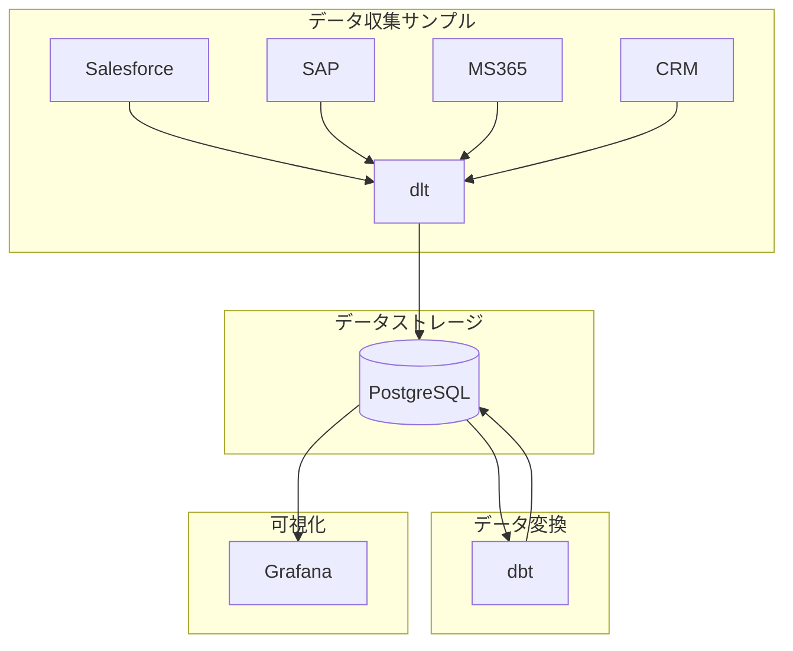

# TBM Template


## 概要

- TBM（Technology Business Management）を小さく始めるためのテンプレートプロジェクトです。
- [Zenn Book: TBMガイド](https://zenn.dev/suwash/books/tbm-guide_202504)をベースにしています。

## システムアーキテクチャ

このプロジェクトは、TBMの基本的な構成要素を含み、Docker Composeを使って簡単に環境を構築できるようになっています。以下のコンポーネントが含まれています：

- **PostgreSQL**: データベース
- **dbt**: データパイプライン
- **dlt**: データ収集
- **Grafana**: 可視化



## 前提条件

- Docker Desktopがインストールされていること
- Git がインストールされていること

## セットアップ方法

### 1. リポジトリのクローン

```bash
git clone https://github.com/suwa-sh/tbm-template.git
cd tbm-template
```

### 2. 環境の起動

```bash
docker compose build
docker compose up -d
# vscode devコンテナとしても利用できます。
```

### 3. サンプルデータのロード

```bash
# dbtコンテナに入る
docker exec -it tbm-dbt bash

# サンプルデータをロード
cd /app/dbt/src
dbt seed --full-refresh
dbt run --full-refresh

# データ検証
dbt test

# ドキュメント生成
dbt docs generate
dbt docs serve

# コンテナから出る
exit
```

- lineage graph
  - 


### 4. Grafanaへのアクセス

- url: <http://localhost:3000>
  - ユーザー名: admin
  - パスワード: admin
- ダッシュボード
  - 全社
    - 
  - 部門ごと
    - 
  - 配賦内訳
    - 

## プロジェクト構成

```
tbm-template/
├── dbt/                    # データパイプライン
│   ├── files/              # dbt設定ファイル
│   └── src/                # dbtプロジェクト
│       ├── seeds/          # サンプルデータ
│       ├── models/         # データモデル
│       └── tests/          # 整合性チェック
├── dlt/                    # データ収集
│   └── connectors/         # 各種データソースコネクタ
├── grafana/                # 可視化
│   └── provisioning/       # Grafana設定
├── compose.yml             # Docker Compose設定
├── Dockerfile.dev          # 開発用Dockerfile
└── requirements.txt        # Pythonパッケージ
```


## カスタマイズ方法

### 配賦ルールのカスタマイズ

配賦ルールは以下のファイルで定義されています：

- `dbt/src/seeds/master_tbm__*.csv`: TBMタクソノミーに合わせた定義 ※基本的に変更不要です。
  - 参考
    - [TBMタクソノミー v4.0 機械翻訳](./docs/TBM_Taxonomy_V4.0_ja.pdf)
    - [TBMタクソノミー v4.0 まとめ](./docs/TBMタクソノミー_v4.0.md)
- `dbt/src/seeds/master__*.csv`: 組織固有のデータ
- `dbt/src/seeds/allocations__*.csv`: 配賦のルール
- `dbt/src/seeds/entries_plan.csv`: 予算データ
- `dbt/src/seeds/entries_cost.csv`: コストデータ

これらのファイルを編集し、`dbt seed`コマンドを実行することで、配賦ルールを更新できます。

### 外部サービスからのデータ収集

`dlt/connectors/`ディレクトリには、以下の外部サービスからデータを収集するためのサンプルコードが含まれています：

- Salesforce
- SAP
- Microsoft 365
- 独自開発CRMシステム

これらのコネクタを実際の環境に合わせてカスタマイズし、`dlt/main.py`を実行することで、データを収集できます。

```bash
# dbtコンテナににdltもインストールされています
docker exec -it tbm-dbt bash

# データ収集を実行
cd /app
python ./dlt/main.py

# コンテナから出る
exit
```
