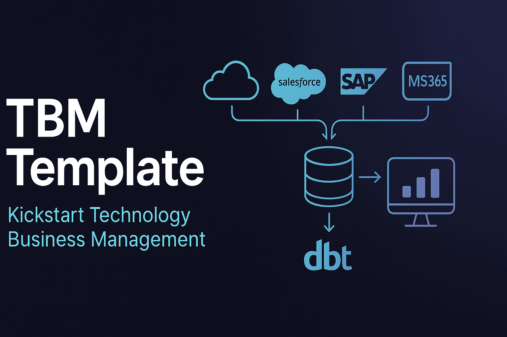

# TBM Template



## 概要

- TBM（Technology Business Management）を小さく始めるためのテンプレートプロジェクトです。
- [Zenn Book: TBMガイド](https://zenn.dev/suwash/books/tbm-guide_202504)をベースにしています。


## 解決する問題

1. **TBM導入の複雑さ**
   - TBMの導入には、データモデルの設計、配賦ルールの定義、データ収集の仕組み構築など、多くの準備が必要です。
     このテンプレートは、基本的な構成要素を提供することで、導入の複雑さを軽減します。

1. **データの可視化**
   - ITコストを様々な視点（財務、IT、ビジネス）で可視化することは容易ではありません。
     このテンプレートは、Grafanaダッシュボードを通じて、すぐに使える可視化を提供します。

1. **データ収集の手間**
   - 外部サービスからのデータ収集は、TBM導入の障壁の一つです。
     このテンプレートは、主要なサービスからのデータ収集サンプルを提供し、カスタマイズの出発点となります。

2. **配賦ルールの設計**
   - コストの配賦ルールを一から設計するのは困難です。
     このテンプレートは、基本的な配賦ルールのサンプルを提供し、組織の実情に合わせてカスタマイズできるようにします。

## ユーザー体験の目標

1. **簡単なセットアップ**
   - Docker Composeを使って、必要な環境を簡単に構築できること。

2. **直感的な理解**
   - サンプルデータを通じて、TBMの基本概念と流れを直感的に理解できること。

3. **カスタマイズの容易さ**
   - 最低限の労力で、実際の環境に合わせてカスタマイズできること。

4. **段階的な拡張**
   - 小さく始めて、徐々に機能や対象範囲を拡張していけること。

5. **価値の実感**
   - TBMがもたらす透明性と意思決定支援の価値を、早い段階で実感できること。

## システムアーキテクチャ

このプロジェクトは、TBMの基本的な構成要素を含み、Docker Composeを使って簡単に環境を構築できるようになっています。以下のコンポーネントが含まれています：

- **PostgreSQL**: データベース
- **dbt**: データパイプライン
- **dlt**: データ収集
- **Grafana**: 可視化


## 動作の仕組み

1. **データの収集**
   - dltで、各種外部サービス（Salesforce、SAP、MS365、独自開発CRM）からデータを収集します。
   - 現在はモックデータを使用して、DBに保存しているだけです。配賦には利用されません。
   - 実際の環境では、APIを通じて実データを収集し、配賦ロジックにつながるようにカスタマイズします。

2. **データの変換と配賦**
   - dbtで、サンプルデータをTBMタクソノミーに基づいて変換し、配賦ルールに従ってコストを配賦します。
   - 配賦の流れは以下の通りです：
     - コストプール → ITタワー
     - ITタワー → テクノロジーサービス
     - テクノロジーサービス → ビジネスユニット
     - テクノロジーサービス → ビジネスケイパビリティ

3. **データの可視化**
   - Grafanaで、変換・配賦されたデータを様々な視点で可視化します。
   - 全社から部門、IT視点、財務視点へとドリルダウンするダッシュボードを提供しています。
   - 配賦の内訳を説明するためのダッシュボードも用意しています。

4. **カスタマイズと拡張**
   - 組織の実情に合わせて、配賦ルール、データ収集、可視化などをカスタマイズします。
   - テンプレートはあくまで出発点であり、実際の環境に合わせて拡張していくことを想定しています。


### 配置図


- vscode devコンテナ での開発が単純になる様に、dltとdbtは同じコンテナに配備しています。

## セットアップ方法

### 0. 前提条件

- Docker Desktopがインストールされていること
- Git がインストールされていること

### 1. リポジトリのクローン

```bash
git clone https://github.com/suwa-sh/tbm-template.git
cd tbm-template
```

### 2. 環境の起動

```bash
docker compose build
docker compose up -d
# vscode devコンテナとしても利用できます。
```

### 3. サンプルデータのロード

```bash
# ELTコンテナに入る
docker exec -it elt bash

# サンプルデータをロード
cd /app/dbt/src
dbt seed --full-refresh
dbt run --full-refresh

# データ検証
dbt test

# ドキュメント生成
dbt docs generate
dbt docs serve

# コンテナから出る
exit
```

- lineage graph
  - 


### 4. Grafanaへのアクセス

- url: <http://localhost:3000>
  - ユーザー名: admin
  - パスワード: admin
- ダッシュボード
  - 全社
    - 
  - 部門ごと
    - 
  - 配賦内訳
    - 

## プロジェクト構成

```
tbm-template/
├── dbt/                    # データパイプライン
│   ├── files/              # dbt設定ファイル
│   └── src/                # dbtプロジェクト
│       ├── seeds/          # サンプルデータ
│       ├── models/         # データモデル
│       └── tests/          # 整合性チェック
├── dlt/                    # データ収集
│   └── connectors/         # 各種データソースコネクタ
├── grafana/                # 可視化
│   └── provisioning/       # Grafana設定
├── compose.yml             # Docker Compose設定
├── Dockerfile.dev          # 開発用Dockerfile
└── requirements.txt        # Pythonパッケージ
```


## カスタマイズ方法

### 配賦ルールのカスタマイズ

配賦ルールは以下のファイルで定義されています：

- `dbt/src/seeds/master_tbm__*.csv`: TBMタクソノミーに合わせた定義 ※基本的に変更不要です。
  - 参考
    - [TBMタクソノミー v4.0 機械翻訳](./docs/TBM_Taxonomy_V4.0_ja.pdf)
    - [TBMタクソノミー v4.0 まとめ](./docs/TBMタクソノミー_v4.0.md)
- `dbt/src/seeds/master__*.csv`: 組織固有のデータ
- `dbt/src/seeds/allocations__*.csv`: 配賦のルール
- `dbt/src/seeds/entries_plan.csv`: 予算データ
- `dbt/src/seeds/entries_cost.csv`: コストデータ

これらのファイルを編集し、`dbt seed`コマンドを実行することで、配賦ルールを更新できます。

### 外部サービスからのデータ収集

`dlt/connectors/`ディレクトリには、以下の外部サービスからデータを収集するためのサンプルコードが含まれています：

- Salesforce
- SAP
- Microsoft 365
- 独自開発CRMシステム

これらのコネクタを実際の環境に合わせてカスタマイズし、`dlt/main.py`を実行することで、データを収集できます。

```bash
# ELTコンテナににdltもインストールされています
docker exec -it elt bash

# データ収集を実行
cd /app
python ./dlt/main.py

# コンテナから出る
exit
```
