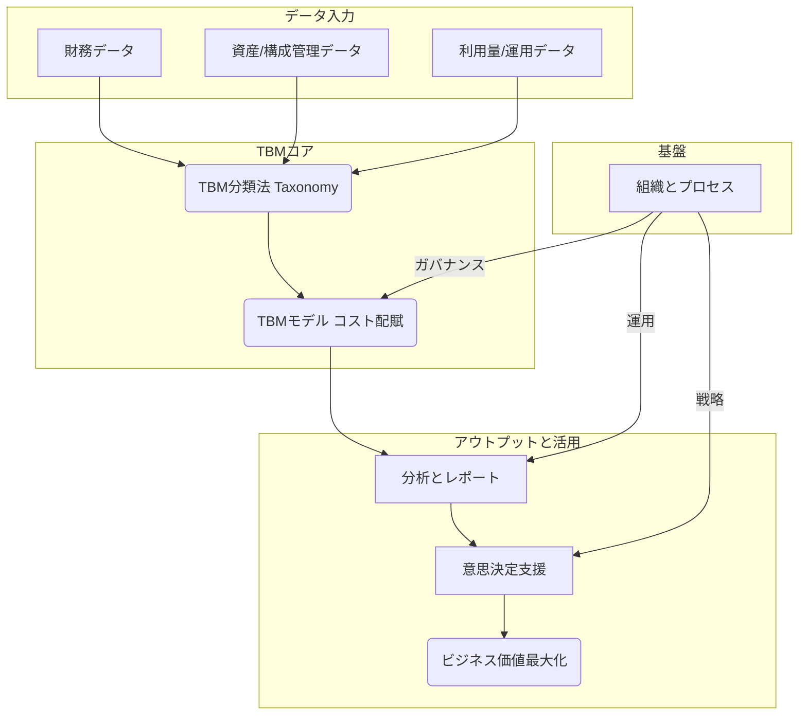
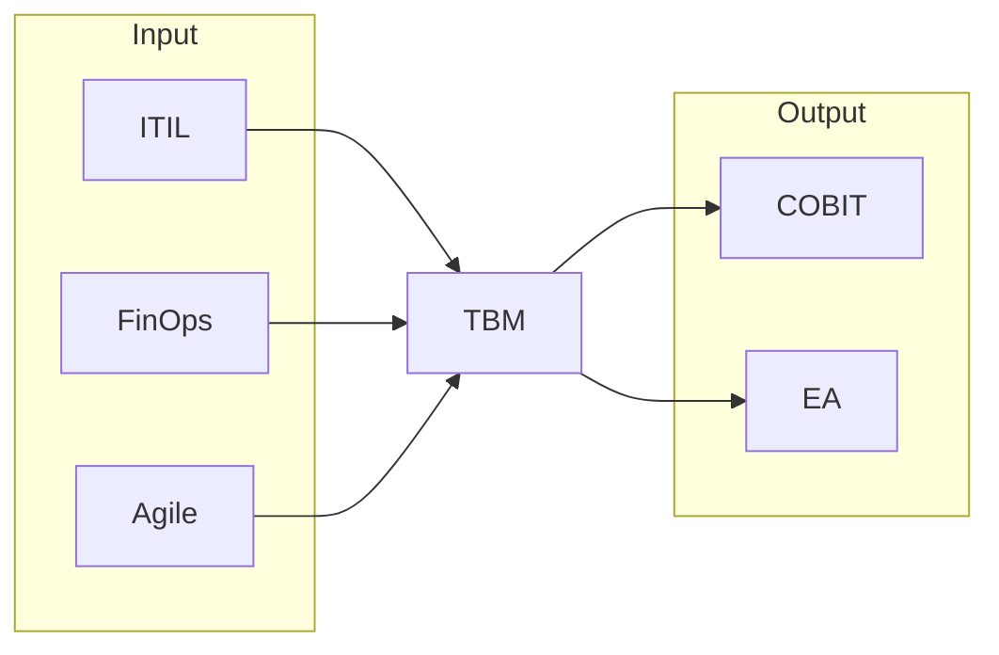
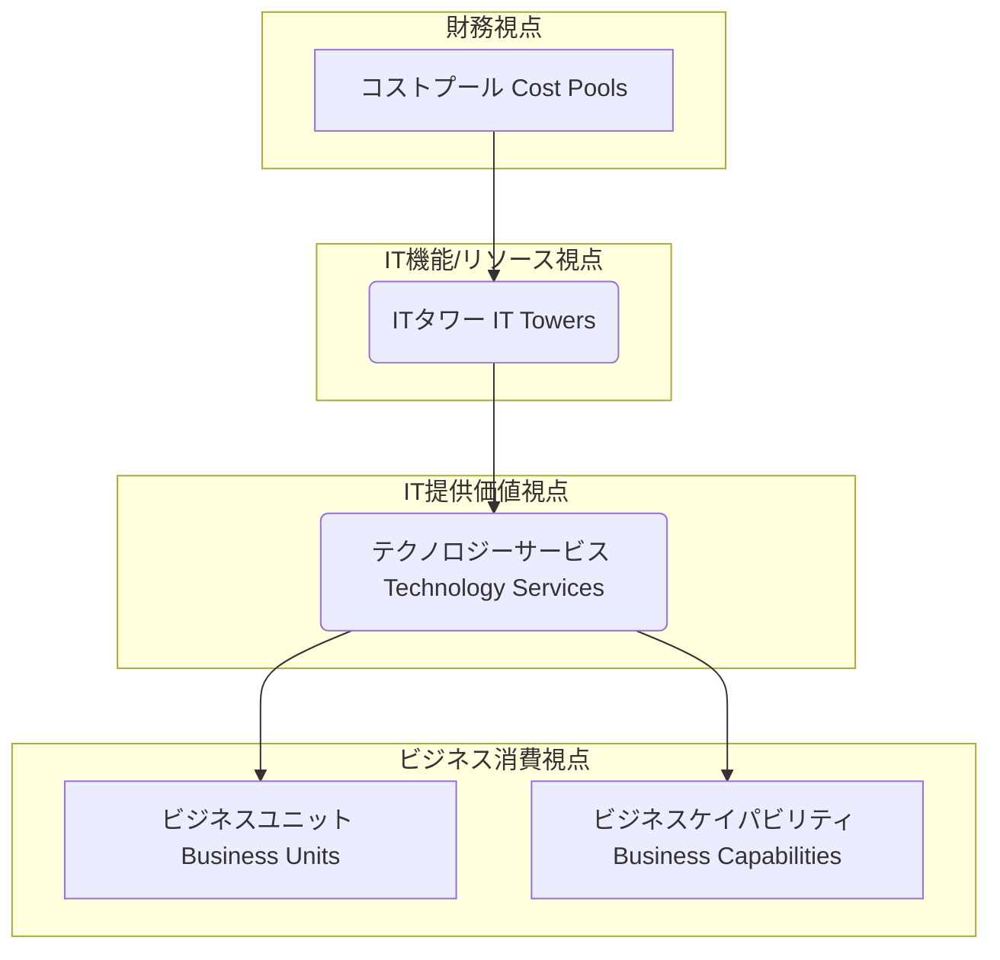
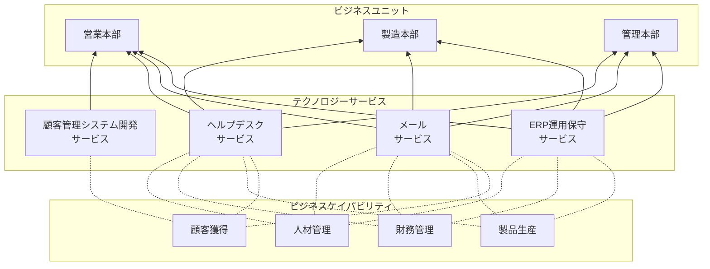
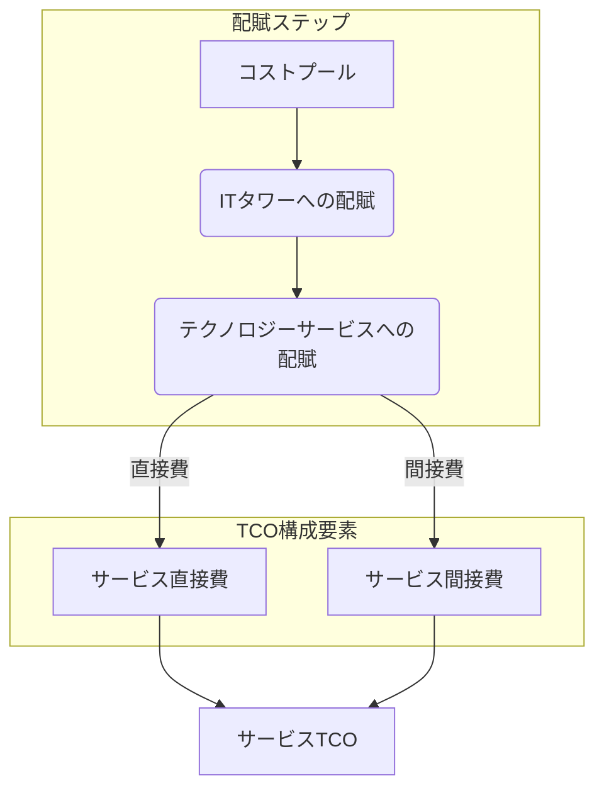
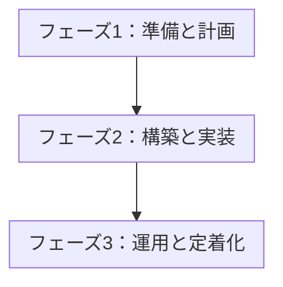
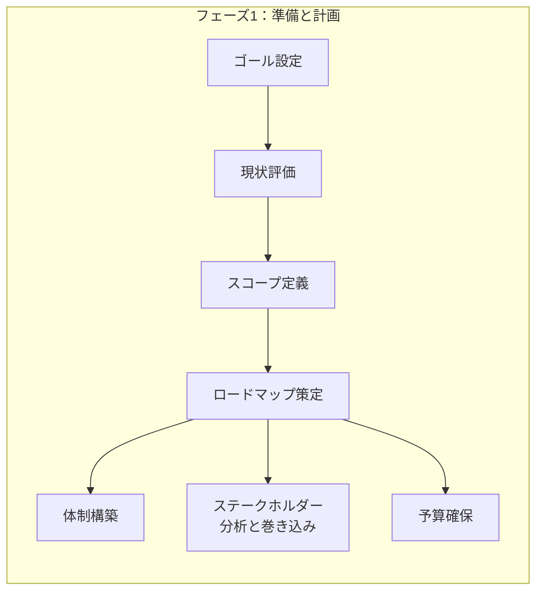
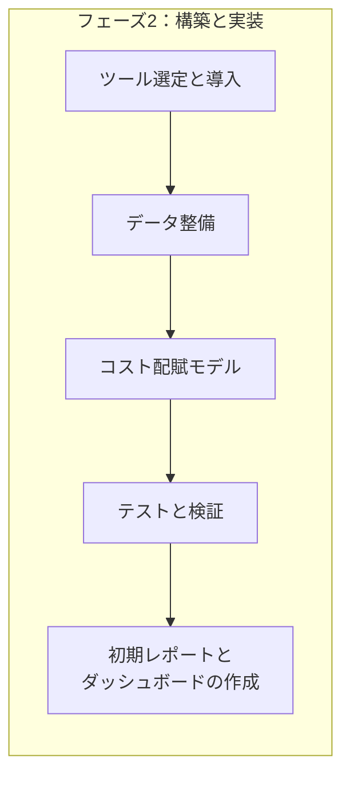
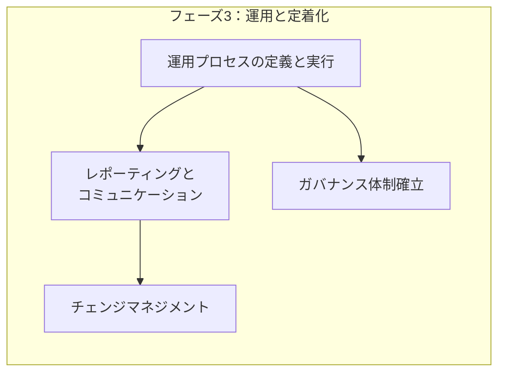

# TBM template

## 方針

- TBM(Technology Business Management)を小さく始めるためのテンプレート。
- 必要な構成をdocker composeで用意できる。
  - postgres: DB
  - dbt: データパイプライン
  - dlt: データ収集
  - grafana: 可視化
- 簡単に動きを確認できる
  - `dbt seed; dbt run;`で、サンプルのデータが可視化される。
    - 会社名: ABC商事
    - 組織: 営業、経理、IT
    - 利用サービス: Salesforce, SAP, MS365
    - 独自開発システム: CRM @オンプレミス
- 最低限のカスタマイズで、TBMを小さく始めることができる
  - 配賦ルールをカスタマイズできる
  - dltで外部サービスからデータ収集するサンプルコードが含まれている
- 以下の記事のポイントが網羅されている

---
## 第1章 TBMとは何か？：IT価値経営の羅針盤

この章では、TBMが登場した背景にある現代のIT部門が抱える課題から説き起こし、TBMの基本的な定義、目的、そしてそれが組織にもたらす具体的な価値を解説します。また、TBMがどのような構成要素から成り立っているかの全体像を示し、ITILやFinOpsといった他の関連フレームワークとの関係性や位置づけを明確にします。TBMを学ぶ上での基礎固めを行います。

### 1.1 なぜTBMが必要なのか？現代IT部門の課題

現代の多くのIT部門は、以下のような共通の課題に直面しています。

| 課題                           | 説明                                                                         | TBMによる貢献                                                                   |
| :----------------------------- | :--------------------------------------------------------------------------- | :------------------------------------------------------------------------------ |
| **コストのブラックボックス化** | ITにどれだけのコストがかかっているのか、その内訳が不明確。                   | ITコストを標準化された分類に基づき可視化し、透明性を向上させます。              |
| **ビジネス貢献度の不明確さ**   | IT投資が具体的にどのビジネス価値に繋がっているのか説明できない。             | ITコストをビジネスサービスや部門に紐付け、ビジネス貢献度を明確にします。        |
| **経営層との溝**               | ITの専門用語が多く、経営層が理解できる言葉でITの価値やコストを説明できない。 | 共通言語（TBM分類法）を提供し、ビジネス視点でのコミュニケーションを促進します。 |
| **投資判断の属人化**           | 新規IT投資や既存システムの維持判断が、勘や経験に頼りがち。                   | データに基づいた客観的な分析を可能にし、合理的な投資判断を支援します。          |
| **リソース配分の非効率**       | 限られたITリソース（人、モノ、金）が最適に配分されていない可能性がある。     | コストと利用状況を分析し、リソース配分の最適化やコスト削減機会を特定します。    |

これらの課題を解決し、IT部門が単なるコストセンターではなく、ビジネス価値を創出する戦略的パートナーへと変革するために、TBMという経営管理手法が求められています。

### 1.2 TBMの定義、目的、そして提供価値

TBM（Technology Business Management）とは、「**ITコストとパフォーマンスに関する透明性を高め、データに基づいた意思決定を支援することで、IT投資のビジネス価値を最大化するための経営管理フレームワーク**」と定義されます。

**TBMの主な目的**は以下の通りです。

* **ITコストの最適化:** 無駄なコストを削減し、効率的なIT運営を実現します。  
* **IT投資の戦略的整合性確保:** IT投資をビジネス戦略と整合させ、優先順位付けを行います。  
* **ビジネス価値の最大化:** ITがビジネスにもたらす価値を明確にし、その向上を図ります。  
* **ITとビジネスの連携強化:** 共通言語とデータに基づき、IT部門とビジネス部門の対話を促進します。

**TBMが組織にもたらす具体的な提供価値**には、以下のようなものがあります。

* **コスト透明性の向上:** ITコストの内訳を詳細に把握できます。  
* **説明責任の明確化:** 誰が、何のために、どれだけのITコストを使っているかを明確にします。  
* **データ駆動型の意思決定:** 勘や経験ではなく、客観的なデータに基づいてIT関連の意思決定を行えます。  
* **サービスベースのコスト管理:** ITをサービスとして捉え、サービスごとのコストと価値を管理できます。  
* **ベンチマーキングの実現:** 自社のITコストや効率性を業界標準と比較できます。  
* **ショーバック/チャージバックの基盤:** 利用部門へのコスト配賦の根拠を提供します。

### 1.3 TBMフレームワークの全体像

*https://www.apptio.com/blog/safe-and-tbm-accelerating-business-value/ から引用*

- **下から上を目指す:**
  - 「`Position for Value`」（IT部門の提供価値の整理）から出発し、「`Continuously Improve`」（提供価値の継続的な改善）を目指します。
- **活動を推進する4つの規律:**
  - 目標達成に向けた活動は、以下の4つの規律によって推進されます。
    - `Create Transparency`（可視化）
    - `Plan and Govern`（IT予算策定・管理）
    - `Deliver Value for Money`（コスト最適化）
    - `Shape Business Demand`（関係性改善）
- **規律の根幹をなす対話:**
  - 上記4つの規律を効果的に実践するためには、関係者間での「`Value Conversations`」（ビジネス成果をつくる対話）が不可欠です。
  - 対話は、主に以下の2つの観点を持ちます。
    - `Run-the-Business`（運用費の継続的削減）
    - `Change-the-Business`（新規開発投資の最適化）
- **対話を具体化するメトリクス:**
  - データに基づいた有意義な対話を実現するには、以下の4つの主要なメトリクス（TBMメトリクス）を用います。
    - `Run-the-Business`に関するメトリクス:
      - `Cost-for-Performance`（コスト対効果）
      - `Business-Aligned Portfolio`（ビジネスへのアライン）
    - `Change-the-Business`に関するメトリクス:
      - `Investment in Innovation`（イノベーションへの投資）
      - `Enterprise Agility`（変化への対応スピード）
- **メトリクスの前提となる可視化:**
    - これらのメトリクスは、可視化によって算出・提示され、議論の基盤となります。
    - `Create Transparency`（可視化）が最初のステップです。

### 1.4 TBMの構成要素と関係性

ITの価値を管理するための要素群を連携して、TBMフレームワークで定義された活動を実現します。

| 要素名                   | 説明                                                                                                                                                         |
| :----------------------- | :----------------------------------------------------------------------------------------------------------------------------------------------------------- |
| **財務データ**           | 会計システムなどから得られるIT関連の支出データ（人件費、購入費など）。                                                                                       |
| **資産/構成管理データ**  | ハードウェア、ソフトウェア、ライセンスなどの資産情報や、それらの構成情報（CMDB）。                                                                           |
| **利用量/運用データ**    | サーバー稼働率、ストレージ使用量、ネットワークトラフィック、サポートコール数など、ITリソースやサービスの利用状況を示すデータ。                               |
| **TBM分類法 (TBM Taxonomy)**   | ITコストやリソースを標準化された階層構造（コストプール、ITタワー、テクノロジーサービスなど）で分類するための定義体系。共通言語の基盤となる。                 |
| **TBMモデル (コスト配賦)** | 収集・分類されたデータを基に、コストプールからITタワー、テクノロジーサービス、最終的にはビジネスユニットやケイパビリティへとコストを割り当てる計算ロジック。 |
| **分析とレポート**       | TBMモデルによって算出されたコスト情報を、ダッシュボードやレポートを通じて可視化し、分析可能な状態にするプロセス。                                            |
| **意思決定支援**         | 可視化・分析された情報に基づき、コスト最適化、投資判断、予算策定などの意思決定を行うプロセス。                                                               |
| **ビジネス価値最大化**   | TBM活動を通じて達成される最終的な目標。IT投資対効果の向上やビジネス貢献度の向上。                                                                            |
| **組織とプロセス**       | TBMを推進・運用するための体制（TBM Officeなど）、役割、責任、およびデータ収集・モデル更新・レポーティングなどの定常的な業務プロセス。                        |

これらの要素が相互に連携し、データ収集から分析、意思決定、そして価値実現へと繋がるサイクルを形成します。

### 1.5 TBMと関連フレームワーク（ITIL, FinOps等）の位置づけ

TBMは独立したフレームワークですが、他のIT管理フレームワークと連携し、相互に補完し合うことで、より大きな効果を発揮します。

| フレームワーク | 主な焦点                                   | TBMとの関係性                                                                                                                      |
| :------------- | :----------------------------------------- | :--------------------------------------------------------------------------------------------------------------------------------- |
| **ITIL**       | ITサービスマネジメント（プロセス改善）     | ITILプロセス（インシデント管理、構成管理等）から生成されるデータはTBMのインプットとなり、TBMはサービスコストの可視化に貢献。       |
| **FinOps**     | クラウド財務管理（コスト最適化、説明責任） | クラウドコストに特化したTBMとも言える。TBMはオンプレミスを含むIT全体の財務管理をカバーし、FinOpsと連携してハイブリッド環境を管理。 |
| **Agile** | ソフトウェア開発（迅速性、適応性）         | TBMはアジャイル開発チームのコストや、開発した機能のビジネス価値を測定・管理するのに役立つ。                                        |
| **COBIT**      | ITガバナンスと管理（統制、リスク）         | TBMはCOBITが要求するIT投資の価値評価やリソース最適化に関する情報を提供し、ガバナンス強化に貢献。                                   |
| **EA**         | エンタープライズアーキテクチャ             | EAはIT資産の標準化や将来像を描き、TBMはそのコストや価値を評価するためのデータを提供する。                                          |

TBMは、これらのフレームワークが持つプロセスやデータを利用しつつ、特に「ITの経済性・価値」という側面に焦点を当て、経営層やビジネス部門とのコミュニケーションを円滑にするための「共通言語」を提供する点で独自性を持っています。

---
## 第2章 TBMの構造：標準分類法（Taxonomy）を理解する

TBMの中核をなすデータ構造の標準である「TBM分類法（Taxonomy）」について詳しく解説します。なぜ標準化された分類法が必要なのか、その全体的な階層構造を示し、各階層（コストプール、ITタワー、テクノロジーサービス、ビジネスユニット/ケイパビリティ）の定義と役割を具体的に説明します。これにより、ITコストデータを整理し、共通言語で議論するための基盤を理解します。

### 2.1 TBM分類法の重要性と階層構造

TBM分類法は、組織全体でITコストに関する「共通言語」を確立するために不可欠です。これにより、部門間での認識齟齬を防ぎ、データに基づいた客観的な議論が可能になります。リンゴとオレンジを比較するのではなく、同じ基準でITコストを評価できるようになります。

TBM分類法は、一般的に以下のような階層構造を持っています。

| 要素名                     | 説明                                                                                                           |
| :------------------------- | :------------------------------------------------------------------------------------------------------------- |
| **コストプール**           | ITコストの発生源となる財務的な費目。会計システムの勘定科目と連携しやすい。                                     |
| **ITタワー**               | ITインフラやリソースを、技術的な機能グループに分類したもの。IT部門内部のコスト構造を把握するのに役立つ。       |
| **テクノロジーサービス**   | ITタワーのリソースを組み合わせて、ビジネスやユーザーに提供される具体的なITサービス。サービスカタログの基礎。   |
| **ビジネスユニット**       | テクノロジーサービスを利用する組織内の事業部や部門。                                                           |
| **ビジネスケイパビリティ** | 組織が持つ事業遂行能力（例：顧客管理、製品開発）。テクノロジーサービスがどのビジネス能力を支えているかを示す。 |

この階層構造により、財務データ（コストプール）から始まり、IT内部の構造（ITタワー）、ITが提供する価値（テクノロジーサービス）、そして最終的にビジネスへの貢献（ビジネスユニット/ケイパビリティ）まで、コストの流れを一貫して追跡・分析することが可能になります。

### 2.2 コストプール：ITコストの源泉を捉える

コストプールは、財務会計システムから取得される最も基本的なコストデータであり、TBM分類法の出発点です。これにより、ITに関連する全ての支出を網羅的に捉えます。

**主なコストプールの例:**

| コストプール                  | 具体例                                                                       |
| :-------------------------------- | :--------------------------------------------------------------------------- |
| **人件費 (Internal Labor)**       | 正社員・契約社員の給与、賞与、福利厚生費                                     |
| **外部委託費 (Outside Services)** | コンサルティング費用、派遣費用、マネージドサービス費用、開発委託費用         |
| **ハードウェア (Hardware)**       | サーバー、ストレージ、ネットワーク機器、PC、プリンターなどの購入費、リース費 |
| **ソフトウェア (Software)**       | パッケージソフトウェアのライセンス購入費、年間保守費用、SaaS利用料           |
| **設備費 (Facilities)**           | データセンターの賃料、電気代、空調費用                                       |
| **通信費 (Telecom)**              | インターネット回線費用、専用線費用、電話料金                                 |
| **その他 (Other)**                | 旅費交通費、研修費、消耗品費など                                             |

これらのコストプールを正確に把握し、分類することが、後続のITタワーやテクノロジーサービスへのコスト配賦の基礎となります。

### 2.3 ITタワー：ITリソースを機能別に整理する

ITタワーは、ITインフラストラクチャやリソースを、技術的な機能に基づいて分類したものです。IT部門がどのような技術領域にコストを投下しているかを理解するのに役立ちます。

**主なITタワーの例:**

| ITタワー                               | 説明                                                                                                                         |
| :----------------------------------- | :--------------------------------------------------------------------------------------------------------------------------- |
| **データセンター**                   | サーバーやストレージなどを設置・運用する物理的な施設に関連するコスト（スペース、電力、空調など）。                           |
| **ネットワーク**                     | LAN、WAN、インターネット接続、ファイアウォール、ロードバランサーなど、通信インフラに関連するコスト。                         |
| **サーバー**                         | 物理サーバー、仮想サーバーのハードウェア、OS、運用管理に関連するコスト。                                                     |
| **ストレージ**                       | SAN、NASなどの共有ストレージ、バックアップシステムに関連するコスト。                                                         |
| **アプリケーション開発/保守**        | ビジネスアプリケーションの新規開発、機能追加、バグ修正、維持管理に関わる人件費、ツール費用など。                             |
| **エンドユーザーコンピューティング** | PC、ノートPC、モバイルデバイス、プリンター、関連ソフトウェア、ヘルプデスクなど、従業員の業務環境に関連するコスト。           |
| **IT管理**                           | 特定のタワーに直接割り当てられない、IT部門全体の管理・企画・セキュリティ・コンプライアンス活動などに関連する間接的なコスト。 |

コストプールから収集されたデータは、まずこれらのITタワーに割り当てられます。例えば、サーバー購入費は「サーバー」タワーへ、ネットワークエンジニアの人件費は「ネットワーク」タワーへと配賦されます。

### 2.4 テクノロジーサービス：IT部門の提供物を定義する

テクノロジーサービスは、ITタワーのリソースを組み合わせて、ビジネス部門やエンドユーザーに提供される具体的なITサービスを定義・分類したものです。IT部門の「製品カタログ」のようなものであり、ITの価値をサービス単位で示す上で非常に重要です。

**主なテクノロジーサービスの例:**

| ITタワー（構成要素）                       | テクノロジーサービス例              | 説明                                                               |
| :----------------------------------------- | :---------------------------------- | :----------------------------------------------------------------- |
| サーバー, ストレージ, ネットワーク, アプリ | **ERP運用保守サービス**             | 企業の基幹業務システム（ERP）を安定稼働させるためのサービス。      |
| サーバー, ストレージ, ネットワーク, アプリ | **メールサービス**                  | 従業員が利用する電子メールシステムの提供・運用サービス。           |
| エンドユーザーコンピューティング           | **ヘルプデスクサービス**            | PCトラブルやソフトウェア操作に関する問い合わせに対応するサービス。 |
| サーバー, ストレージ, ネットワーク         | **ファイル共有サービス**            | 組織内でファイルを安全に共有・保管するためのサービス。             |
| アプリケーション開発/保守                  | **顧客管理システム開発サービス**    | 新しい顧客管理システムを構築するためのプロジェクトサービス。       |
| ネットワーク                               | **リモートアクセス（VPN）サービス** | 社外から社内ネットワークへ安全に接続するためのサービス。           |
| サーバー, アプリ                           | **Webホスティングサービス**         | 企業のウェブサイトを公開・運用するための基盤サービス。             |

各テクノロジーサービスのコスト（TCO: Total Cost of Ownership）は、それを構成するITタワーのコストを配賦することで計算されます。例えば、「メールサービス」のコストは、関連するサーバー、ストレージ、ネットワーク、ソフトウェアライセンス、運用人件費などを合算して算出されます。

### 2.5 ビジネスへの接続：部門別コストとビジネス価値の紐付け

TBM分類法の最終段階は、テクノロジーサービスのコストを、それを利用するビジネス側（ビジネスユニットやビジネスケイパビリティ）に紐付けることです。これにより、「どのビジネス活動に、どれだけのITコストが貢献しているか」を可視化します。

**紐付けの例:**

| 要素名                     | 説明                                                                                                     |
| :------------------------- | :------------------------------------------------------------------------------------------------------- |
| **テクノロジーサービス**   | IT部門が提供するサービス（例：ERP運用保守）。                                                            |
| **ビジネスユニット**       | サービスを利用する組織部門（例：営業本部、製造本部）。利用量などに基づいてコストが配賦されることが多い。 |
| **ビジネスケイパビリティ** | サービスが支える事業遂行能力（例：顧客獲得、製品生産）。ITがどのビジネス機能に貢献しているかを示す。     |

この紐付けにより、以下のような分析が可能になります。

* 営業本部は、年間でXXX円のITコスト（ERP、メール、ヘルプデスク、顧客管理システム開発）を消費している。  
* 「製品生産」というビジネスケイパビリティは、主にERP運用保守サービスによって支えられており、そのコストはYYY円である。

これにより、ビジネス部門は自らが利用するITサービスのコストを認識し、IT部門は自らの活動がビジネスにどう貢献しているかを具体的に説明できるようになります。

### 2.6 【具体例】分類法を用いたデータ整理のサンプル

架空の企業「ABC商事」のITコストデータを、TBM分類法を用いて整理する簡単な例を示します。

**ステップ1: コストプールの特定**

財務データから、以下のようなIT関連支出が特定されました。

| 勘定科目             | 金額（年間） | コストプール分類 |
| :------------------- | :----------- | :--------------- |
| サーバー購入費       | 500万円      | ハードウェア     |
| A社への開発委託費    | 1,000万円    | 外部委託費       |
| 正社員エンジニア給与 | 2,000万円    | 人件費           |
| データセンター利用料 | 300万円      | 設備費           |
| ERPライセンス費用    | 800万円      | ソフトウェア     |
| ...                  | ...          | ...              |

**ステップ2: ITタワーへの割り当て**

各コストプールを、関連するITタワーに割り当てます。

| コストプール | 金額      | 割り当て先ITタワー                                              |
| :----------- | :-------- | :-------------------------------------------------------------- |
| ハードウェア | 500万円   | サーバー                                                        |
| 外部委託費   | 1,000万円 | アプリケーション開発/保守                                       |
| 人件費       | 2,000万円 | サーバー(50%), ネットワーク(30%), アプリ(20%) ※作業時間等で按分 |
| 設備費       | 300万円   | データセンター                                                  |
| ソフトウェア | 800万円   | アプリケーション開発/保守                                       |
| ...          | ...       | ...                                                             |

**ステップ3: テクノロジーサービスへの割り当て**

ITタワーのコストを、関連するテクノロジーサービスに割り当てます（配賦ロジックは第3章で詳述）。

| ITタワー                  | コスト（仮） | 割り当て先テクノロジーサービス（一部）                                       |
| :------------------------ | :----------- | :--------------------------------------------------------------------------- |
| サーバー                  | 1,000万円    | ERP運用保守(40%), メール(20%), ファイル共有(20%), Webホスティング(10%), ...  |
| ネットワーク              | 600万円      | ERP運用保守(30%), メール(30%), ファイル共有(20%), リモートアクセス(10%), ... |
| アプリケーション開発/保守 | 2,200万円    | ERP運用保守(60%), 顧客管理開発(30%), ...                                     |
| ...                       | ...          | ...                                                                          |

これにより、「ERP運用保守サービス」のコストが、サーバー、ネットワーク、アプリケーション保守などのコストを集計して算出されます。

**ステップ4: ビジネスユニットへの割り当て**

テクノロジーサービスのコストを、利用部門（ビジネスユニット）に割り当てます。

| テクノロジーサービス | コスト（仮） | 利用部門（割り当て例）                                        |
| :------------------- | :----------- | :------------------------------------------------------------ |
| ERP運用保守          | 1,500万円    | 営業本部(30%), 製造本部(50%), 管理本部(20%) ※利用ID数など     |
| メールサービス       | 500万円      | 営業本部(40%), 製造本部(40%), 管理本部(20%) ※メールボックス数 |
| ...                  | ...          | ...                                                           |

この結果、「営業本部はERP運用保守に年間450万円、メールサービスに年間200万円を消費している」といった情報が得られます。

このように、TBM分類法を用いることで、元の財務データが段階的に加工され、最終的にビジネス視点でのコスト情報へと変換されます。

---
## 第3章 TBMの心臓部：コスト配賦モデルを構築する

収集したデータをTBM分類法に基づいて加工し、コストプールから最終的なビジネス消費単位（サービス、部門、ケイパビリティ）へとコストを割り当てる「コスト配賦モデル」の構築方法について解説します。データ収集の戦略から、配賦ロジックの設計、サービスTCOの計算、そしてモデル構築の実践的なステップまでをカバーします。

### 3.1 TBMモデルの目的と設計思想

TBMにおけるコスト配賦モデルは、単なるコスト計算の仕組みではありません。その主な目的は以下の通りです。

* **透明性の確保:** ITコストがどのように発生し、どのサービスやビジネス活動に使われているかを明確にします。  
* **公平性の担保:** 合理的な根拠に基づき、コストを利用者（サービス、部門）に公平に割り当てます。  
* **説明責任の向上:** 各コストの発生理由と配賦根拠を明確にし、説明責任を果たせるようにします。  
* **意思決定の支援:** サービスごとの正確なコスト（TCO）を算出し、投資判断や価格設定などの意思決定を支援します。

**モデル設計における重要な原則（思想）:**

| 設計原則   | 説明                                                                                                               |
| :--------- | :----------------------------------------------------------------------------------------------------------------- |
| **透明性** | 配賦ロジックは理解しやすく、追跡可能であるべきです。なぜそのコストが割り当てられたのかを説明できる必要があります。 |
| **公平性** | コストの恩恵を受ける主体（サービス、部門）が、そのコストを合理的に負担するように設計します。                       |
| **正確性** | 利用可能なデータと労力のバランスを取りながら、可能な限り実態に近いコスト配賦を目指します。                         |
| **一貫性** | 配賦ルールは明確に定義され、継続的に適用されるべきです。恣意的な変更は避けるべきです。                             |
| **実用性** | モデルの維持・運用にかかる労力が過大にならないよう、シンプルさと自動化を考慮します。                               |
| **柔軟性** | ビジネスや技術の変化に対応できるよう、モデルの修正や更新が比較的容易に行えるように設計します。                     |

完璧なモデルを目指すあまり複雑になりすぎると、維持が困難になったり、関係者の理解を得られなくなったりします。実用性と精度のバランスを取ることが重要です。

### 3.2 データ収集戦略：必要な情報源と品質確保

正確で信頼性の高いコスト配賦モデルを構築するには、質の高いデータが不可欠です。

**主なデータソース:**

| データカテゴリ       | 具体的なデータ例                                                                             | 主な情報源システム例                                    |
| :------------------- | :------------------------------------------------------------------------------------------- | :------------------------------------------------------ |
| **財務データ**       | 勘定科目別支出、資産計上額、減価償却費、部門別経費                                           | ERP、会計システム                                       |
| **資産管理データ**   | ハードウェア資産台帳（サーバー、PC等）、ソフトウェアライセンス台帳                           | 資産管理ツール、構成管理データベース（CMDB）            |
| **構成管理データ**   | サーバーとアプリケーションの関係、ネットワーク構成情報、仮想化環境情報                       | CMDB、仮想化管理ツール                                  |
| **利用量データ**     | CPU使用率、メモリ使用量、ストレージ消費量、ネットワークトラフィック、APIコール数、ログイン数 | 監視ツール、ログ管理ツール、APMツール、クラウド請求明細 |
| **人事データ**       | 従業員情報（所属部門、役職）、工数データ（プロジェクト別、作業別）                           | 人事システム、工数管理ツール                            |
| **契約データ**       | 外部委託契約、リース契約、保守契約、SaaS契約                                                 | 契約管理システム、購買システム                          |
| **サービスカタログ** | 提供しているテクノロジーサービスの一覧、サービス定義                                         | ITSMツール、サービスカタログ管理ツール                  |

**データ収集・品質確保のポイント:**

* **早期のデータ評価:** モデル構築に着手する前に、必要なデータがどこに、どのような形式・品質で存在するかを評価します。  
* **データオーナーシップの明確化:** 各データソースの責任者（データオーナー）を特定し、協力体制を築きます。  
* **自動化の推進:** 手作業によるデータ収集・加工はエラーの元であり、非効率です。可能な限りETLツールなどを活用し、データ連携を自動化します。  
* **データクレンジング:** 不足データ、誤記、重複などを特定し、修正・補完するプロセスを確立します。  
* **定期的なレビュー:** データの鮮度と正確性を維持するため、定期的にデータソースと収集プロセスを見直します。  
* **マスターデータの整備:** サーバー名、アプリケーション名、部門名などのマスターデータを整備し、表記ゆれを防ぎます。

データ品質はTBMの成否を左右する重要な要素です。初期段階で十分な時間と労力をかけることが、後の手戻りを防ぎます。

### 3.3 コスト配賦ロジック：主要な基準と選択のポイント

コスト配賦ロジックは、ある階層（例：コストプール）のコストを、次の階層（例：ITタワー）に割り当てるためのルールです。適切な基準を選択することが、公平で実態に合ったモデル構築の鍵となります。

**主要な配賦基準:**

| 配賦基準                        | 説明                                                                                          | メリット                           | デメリット                                       | 適用例                                                                                 |
| :------------------------------ | :-------------------------------------------------------------------------------------------- | :--------------------------------- | :----------------------------------------------- | :------------------------------------------------------------------------------------- |
| **直接割り当て (Direct)**       | 特定のサービスや部門に直接紐づけられるコスト。                                                | 最も正確で公平。                   | 適用できるコストが限定的。                       | 特定プロジェクト専用のサーバー購入費、特定部門専用のソフトウェアライセンス費。         |
| **利用量ベース (Usage-based)**  | CPU時間、ストレージ容量、ネットワーク帯域、トランザクション数など、実際の利用量に応じて配賦。 | 公平性が高い（使った分だけ負担）。 | 正確な利用量データの収集・測定が必要。           | 共有サーバーコストのサービスへの配賦、ネットワークコストの部門への配賦。               |
| **数量ベース (Unit-based)**     | サーバー台数、PC台数、ユーザー数、メールボックス数など、関連するユニット数に応じて配賦。      | 比較的シンプルで理解しやすい。     | 利用実態と乖離する可能性あり。                   | ヘルプデスクコストのユーザー数での部門配賦、PC関連コストのPC台数での部門配賦。         |
| **固定比率 (Fixed Allocation)** | 事前に定義された固定の割合（例：部門別売上比率、従業員数比率）で配賦。                        | シンプルで計算が容易。             | 実態との乖離が大きい場合、不公平感が生じやすい。 | IT管理部門コストの各ITタワーへの配賦、データセンター共通費用のサーバータワーへの配賦。 |
| **均等割り (Even Spread)**      | 対象となる配賦先全体で均等に割り振る。                                                        | 最もシンプル。                     | 最も公平性に欠ける可能性が高い。                 | 他の基準が適用困難な場合の最終手段（推奨されない）。                                   |

**基準選択のポイント:**

* **因果関係:** コスト発生の原因となる活動やリソース消費に最も近い基準を選びます（例：サーバーコストならCPU利用時間）。  
* **データの利用可能性:** 理想的な基準があっても、そのためのデータが取得できなければ意味がありません。利用可能なデータの中で最も合理的な基準を選択します。  
* **重要性:** コストインパクトが大きい項目には、より精度の高い基準（利用量ベースなど）を適用し、小さい項目にはシンプルな基準（数量ベース、固定比率）を適用するなど、メリハリをつけます。  
* **関係者の納得感:** なぜその基準が選ばれたのかを関係者に説明し、理解と合意を得ることが重要です。

一つの基準に固執せず、コストの種類や性質に応じて複数の基準を組み合わせることが一般的です。

### 3.4 サービスTCO算出プロセス詳解

テクノロジーサービスの総所有コスト（TCO: Total Cost of Ownership）は、そのサービスを提供するために直接・間接にかかる全てのコストを合算したものです。TBMモデルにおける重要なアウトプットの一つです。

**TCO算出の一般的なプロセス:**

| 要素名                           | 説明                                                                                                                                                                                                     |
| :------------------------------- | :------------------------------------------------------------------------------------------------------------------------------------------------------------------------------------------------------- |
| **コストプール**                 | 財務データから得られるIT関連の全支出。                                                                                                                                                                   |
| **ITタワーへの配賦**             | コストプールの費用を、関連するITタワー（サーバー、ネットワーク、ストレージ等）に割り当てる。配賦基準（直接、数量ベース等）を用いる。                                                                     |
| **テクノロジーサービスへの配賦** | 各ITタワーのコストを、それを利用するテクノロジーサービス（メールサービス、ERP運用保守等）に割り当てる。配賦基準（利用量ベース、数量ベース等）を用いる。                                                  |
| **サービス直接費**               | 特定のテクノロジーサービスに直接起因するコスト。例えば、メールサービス専用サーバーの減価償却費、メールソフトのライセンス費、メール担当者の人件費など。                                                   |
| **サービス間接費**               | 複数のサービスで共有されるインフラ（共有ストレージ、ネットワーク機器）や、IT管理部門などの間接部門のコストのうち、当該サービスに割り当てられた部分。ITタワーからの配賦計算によって算出されることが多い。 |
| **サービスTCO**                  | サービス直接費とサービス間接費を合算したもの。そのテクノロジーサービスを提供するための総コストを示す。                                                                                                   |

**算出例（メールサービスTCO）:**

* **直接費:**  
  * メールサーバー減価償却費: 50万円  
  * メールソフトライセンス費: 100万円  
  * メール担当者人件費: 300万円  
* **間接費（配賦されたコスト）:**  
  * 共有ストレージコスト (利用容量ベースで配賦): 80万円  
  * ネットワークコスト (利用帯域ベースで配賦): 60万円  
  * データセンターコスト (サーバーラック数で配賦): 40万円  
  * IT管理部門コスト (サービスコスト比率で配賦): 70万円  
* **メールサービスTCO = (50 + 100 + 300) + (80 + 60 + 40 + 70) = 700万円**

このようにして算出されたサービスTCOは、サービス価格設定、アウトソーシング判断、コスト削減努力の効果測定などに活用されます。

### 3.5 モデル構築のステップとツール活用

コスト配賦モデルを実際に構築する手順は、一般的に以下のステップで進められます。

1. **要件定義:**  
   * モデルの目的、スコープ（対象範囲）、アウトプット（必要なレポート等）を明確にします。  
   * TBM分類法を組織に合わせて定義・確定します。  
2. **データ収集と準備:**  
   * 必要なデータソースを特定し、収集・統合します。  
   * データのクレンジング、フォーマット統一、マスターデータ整備を行います。  
3. **配賦ルールの設計:**  
   * 各階層間（コストプール→ITタワー、ITタワー→テクノロジーサービス、サービス→ビジネスユニット）の配賦基準と計算ロジックを定義します。  
   * 関係者と合意形成を行います。  
4. **モデルの実装（計算実行）:**  
   * 設計した配賦ルールに基づき、実際にコスト計算を実行します。専用ツール、BIツール、あるいはスプレッドシートなどを利用します。  
5. **結果検証と調整:**  
   * 算出された結果（ITタワー別コスト、サービスTCO、部門別コスト）が妥当であるかを確認します。  
   * 異常値や想定外の結果があれば、データや配賦ルールを見直し、調整します。  
6. **文書化:**  
   * TBM分類法の定義、データソース、配賦ルール、計算プロセスなどを文書化し、関係者が参照できるようにします。  
7. **運用プロセス定義:**  
   * データの定期的な更新、モデルのメンテナンス、レポーティングのサイクルなど、定常的な運用プロセスを定義します（第4章で詳述）。

**ツール活用:**

TBMモデルの構築と運用には、多くの場合ツールが活用されます。

| ツール種類           | 主な機能                                                                                                     | 代表的な製品例（一部）         |
| :------------------- | :----------------------------------------------------------------------------------------------------------- | :----------------------------- |
| **TBM専用ツール**    | データ収集・統合、TBM分類法管理、配賦モデル構築・実行、レポーティング、分析機能などを網羅的に提供。          | Apptio, Nicus, ServiceNow ITBM |
| **BIツール**         | データ可視化、レポーティング、ダッシュボード作成に強み。配賦計算は別途行うか、ツールの計算機能を利用。       | Tableau, Power BI, Qlik Sense  |
| **スプレッドシート** | 小規模な導入や初期の試行には利用可能。データ量やモデルの複雑性が増すと、管理やメンテナンスが困難になる傾向。 | Microsoft Excel, Google Sheets |

**ツール選択のポイント:**

* **機能要件:** 自社のTBM要件（モデルの複雑性、必要な分析機能、レポート種類など）を満たせるか。  
* **データ連携:** 既存システム（ERP, CMDB等）とのデータ連携が容易か。  
* **操作性:** モデル設定やレポート作成が直感的に行えるか。  
* **拡張性:** 将来的なスコープ拡大や要件変更に対応できるか。  
* **コスト:** ライセンス費用、導入・維持費用。

ツールの導入は必須ではありませんが、特に中規模以上の組織で本格的にTBMを実践する場合、専用ツールやBIツールの活用が効率性と持続可能性を高めます。

### 3.6 【具体例】シンプルな配賦モデルのケーススタディ

小規模なIT環境を想定し、コストプールからITタワー、サービスへとコストを配賦するシンプルなモデルの構築例をステップバイステップで示します。

**前提:**

* **コストプール:**  
  * サーバー購入費: 100万円  
  * ネットワーク機器購入費: 50万円  
  * エンジニア人件費: 600万円  
  * データセンター費用: 120万円  
* **ITタワー:** サーバー, ネットワーク  
* **テクノロジーサービス:** Webサービス, DBサービス  
* **配賦に必要な情報:**  
  * エンジニア工数: サーバー担当 70%, ネットワーク担当 30%  
  * データセンター利用: サーバー 80%, ネットワーク 20% (スペース比率)  
  * サーバーリソース利用: Webサービス 60%, DBサービス 40% (CPU時間比率)  
  * ネットワークリソース利用: Webサービス 50%, DBサービス 50% (トラフィック量比率)

**ステップ1: コストプール → ITタワーへの配賦**

| コストプール           | 金額    | 配賦基準      | サーバータワーへ | ネットワークタワーへ |
| :--------------------- | :------ | :------------ | :--------------- | :------------------- |
| サーバー購入費         | 100万円 | 直接          | 100万円          | 0円                  |
| ネットワーク機器購入費 | 50万円  | 直接          | 0円              | 50万円               |
| エンジニア人件費       | 600万円 | 工数比率(7:3) | 420万円          | 180万円              |
| データセンター費用     | 120万円 | 利用比率(8:2) | 96万円           | 24万円               |
| **ITタワー合計コスト** |         |               | **616万円**      | **254万円**          |

**ステップ2: ITタワー → テクノロジーサービスへの配賦**

| ITタワー           | コスト  | 配賦基準          | Webサービスへ | DBサービスへ  |
| :----------------- | :------ | :---------------- | :------------ | :------------ |
| サーバータワー     | 616万円 | リソース利用(6:4) | 369.6万円     | 246.4万円     |
| ネットワークタワー | 254万円 | リソース利用(5:5) | 127.0万円     | 127.0万円     |
| **サービスTCO**    |         |                   | **496.6万円** | **373.4万円** |

**結果:**
WebサービスのTCOは **496.6万円**
DBサービスのTCOは **373.4万円**

---
## 第4章 TBM導入ジャーニー：計画から定着までの道のり

TBMを組織に導入し、効果的に運用していくためのプロセス（ライフサイクル）を時系列に沿って解説します。導入前の準備・計画段階から、実際のシステム構築・実装段階、そして導入後の運用・定着化段階までの主要な活動、考慮事項、成功のためのポイントを説明します。

### 4.1 フェーズ1：準備と計画

TBM導入プロジェクトを成功させるためには、事前の準備と計画が極めて重要です。この段階で方向性を誤ると、後のフェーズで大きな手戻りが発生したり、導入効果が得られなかったりする可能性があります。

**主要な活動:**

1. **ゴール設定:**  
   * **何を達成したいのか？** TBM導入によって解決したい課題や達成したい目標を具体的に定義します。（例: ITコストの10%削減、部門別ITコストの完全な可視化、IT投資判断プロセスの迅速化）  
   * **測定可能な目標:** ゴールは可能な限り定量的で測定可能なもの（KPI）を設定します。  
   * **ステークホルダーとの合意:** 経営層、IT部門、ビジネス部門など、主要なステークホルダー間でゴールの認識を合わせます。  
2. **現状評価 (As-Is Analysis):**  
   * 現在のITコスト管理プロセス、データの状況（可用性、品質）、組織体制、利用ツールなどを評価し、課題と改善機会を特定します。  
   * TBM導入に向けた準備状況（成熟度）を把握します。  
3. **スコープ定義:**  
   * **どこから始めるか？** 最初から全社・全ITサービスを対象とするのか、特定の部門やサービス領域に限定してスモールスタートするのかを決定します。  
   * 段階的に導入する場合のフェーズ分けを検討します。  
4. **ロードマップ策定:**  
   * 設定したゴールとスコープに基づき、TBM導入完了までの具体的なステップ、タイムライン、マイルストーンを定義します。  
   * 各フェーズでの成果物や目標を明確にします。  
5. **体制構築:**  
   * **誰が推進するのか？** TBM導入を主導するプロジェクトチームや、導入後の運用を担う専門組織（TBM Officeなど）の設置を検討します。  
   * 各メンバーの役割と責任を明確にします。  
   * **経営層のスポンサーシップ:** プロジェクトの成功には、経営層からの強力な支持とコミットメントが不可欠です。  
6. **ステークホルダー分析と巻き込み:**  
   * TBM導入に関わる全てのステークホルダー（経営層、ITリーダー、財務部門、ビジネス部門長、サービスオーナー、現場担当者など）を特定します。  
   * 各ステークホルダーの期待、懸念、影響度を分析し、早期からコミュニケーションを図り、協力を得るための計画を立てます。  
7. **予算確保:**  
   * ツール導入費用、コンサルティング費用、内部リソース工数など、TBM導入に必要な予算を見積もり、確保します。

**成功のポイント:**

* **明確で合意されたゴール:** 関係者全員が同じ目標に向かって進むことが重要です。  
* **経営層の強力なコミットメント:** 予算確保、部門間の協力促進、意思決定の推進力となります。  
* **現実的なロードマップ:** 無理のない計画を立て、早期に小さな成功（Quick Win）を示すことで、関係者のモチベーションを維持します。  
* **専任の推進体制:** 片手間の取り組みでは成功は難しい場合が多いです。

### 4.2 フェーズ2：構築と実装

計画フェーズで定義されたゴールとロードマップに基づき、TBMを実現するためのシステム的な基盤を構築するフェーズです。

**主要な活動:**

1. **ツール選定と導入:**  
   * **要件定義:** 自社のニーズ（機能、データ連携、操作性、拡張性、予算など）に合ったツールを選定するための基準を明確にします。  
   * **ベンダー評価:** 複数のツールベンダーを比較検討し、デモンストレーションやPoC（Proof of Concept: 概念実証）を通じて評価します。  
   * **導入と設定:** 選定したツールを導入し、初期設定（ユーザー管理、TBM分類法の設定など）を行います。  
2. **データ整備:**  
   * **データソース特定と接続:** TBMモデルに必要なデータソース（財務、資産、構成、利用量など）を特定し、ツールとの連携を設定します。ETL（Extract, Transform, Load）プロセスを構築します。  
   * **データクレンジングと変換:** 収集したデータの品質を確認し、欠損値の補完、表記ゆれ修正、必要な形式への変換などを行います。データ品質が低い場合は、データソース側の改善も必要になります。  
   * **マスターデータ管理:** サーバー名、アプリケーション名、部門コードなどのマスターデータを整備し、一貫性を保ちます。  
3. **コスト配賦モデルの設計と構築:**  
   * **配賦ルールの詳細化:** 第3章で解説した考え方に基づき、具体的な配賦基準（直接、利用量、数量、固定比率など）と計算ロジックを階層ごとに詳細に定義します。  
   * **モデルの実装:** 定義した配賦ルールをTBMツール上、またはBIツールやスプレッドシート上に実装します。  
   * **パラメータ設定:** 配賦計算に必要なパラメータ（例: サーバー単価、ネットワーク帯域単価、部門別人数比率など）を設定します。  
4. **テストと検証:**  
   * **計算結果の確認:** 実装したモデルでコスト計算を実行し、結果（ITタワー別コスト、サービスTCO、部門別コストなど）が想定通りか、妥当な範囲に収まっているかを確認します。  
   * **ドリルダウン検証:** 特定のコストがどのように配賦されてきたかをドリルダウンして追跡し、ロジックの正しさを検証します。  
   * **関係者レビュー:** IT部門や財務部門などの関係者に計算結果をレビューしてもらい、フィードバックを得てモデルを調整します。  
5. **初期レポートとダッシュボードの作成:**  
   * 検証されたデータに基づき、主要なステークホルダー向けの初期レポートやダッシュボードを作成します。（第5章で詳述）

**成功のポイント:**

* **データ品質への注力:** 「Garbage In, Garbage Out（ゴミを入れたらゴミしか出てこない）」の原則を忘れず、データ整備に十分な時間と労力をかけます。  
* **反復的なアプローチ:** 最初から完璧なモデルを目指すのではなく、まずはシンプルなモデルから始めて、テストと検証、フィードバックを通じて段階的に洗練させていきます。  
* **ツールベンダーやコンサルタントの活用:** 必要に応じて、専門家の知見や経験を活用することも有効です。

### 4.3 フェーズ3：運用と定着化

TBMの仕組みを構築しただけでは価値は生まれません。それを日常業務として継続的に運用し、組織文化として根付かせるための活動が重要です。

**主要な活動:**

1. **運用プロセスの定義と実行:**  
   * **データ更新サイクル:** 財務データ、利用量データなどを定期的に（月次、四半期など）収集・更新するプロセスを定義し、実行します。  
   * **モデルメンテナンス:** 組織変更、新しいテクノロジーの導入、ビジネスの変化などに合わせて、TBM分類法や配賦モデルを定期的に見直し、更新するプロセスを確立します。  
   * **レポーティングサイクル:** 定期的にレポートやダッシュボードを作成・配信するスケジュールと担当者を定義します。  
   * **役割と責任の明確化:** データ提供者、モデル管理者、レポート作成者、分析担当者など、運用に関わる各担当者の役割と責任を明確にします。  
2. **レポーティングとコミュニケーション:**  
   * **ステークホルダー別レポート:** 経営層、ITリーダー、ビジネス部門リーダーなど、受け手のニーズに合わせたレポートやダッシュボードを提供します。（第5章で詳述）  
   * **定期的なレビュー会議:** TBMデータに基づき、コスト状況、サービスパフォーマンス、投資対効果などを議論する定期的な会議（例: IT財務レビュー会議、ビジネス部門とのQBR - Quarterly Business Review）を設定します。  
   * **共通言語としての活用:** TBM分類法とデータを共通言語として、ITとビジネス間のコミュニケーションを促進します。  
3. **チェンジマネジメント（組織変革管理）:**  
   * **トレーニング:** TBMの概念、ツール操作、レポートの見方などについて、関係者向けのトレーニングを実施します。  
   * **コミュニケーション:** TBM導入の目的、進捗、成果などを組織全体に継続的に伝え、理解と協力を促します。  
   * **意識改革:** ITコストに対する意識を高め、データに基づいた意思決定を行う文化を醸成します。抵抗勢力への対応も考慮します。  
   * **成功事例の共有:** TBMを活用してコスト削減や価値向上に繋がった具体的な事例を共有し、他の部門や担当者のモチベーションを高めます。  
   * **フィードバック収集と改善:** TBM運用に対する関係者からのフィードバックを収集し、プロセスやツールの改善に繋げます。  
4. **ガバナンス体制の確立:**  
   * TBMの標準（分類法、配賦ルールなど）を維持し、一貫性を保つためのガバナンス体制（例: TBM Council、運営委員会）を確立します。  
   * モデル変更時の承認プロセスなどを定義します。

**成功のポイント:**

* **継続的な改善:** TBMは一度導入したら終わりではありません。ビジネスの変化に合わせて、プロセスやモデルを継続的に見直し、改善していく姿勢が重要です。  
* **チェンジマネジメントへの投資:** 新しい仕組みやプロセスを導入する際には、必ず変化に対する抵抗が起こります。丁寧なコミュニケーションとトレーニング、関係者の巻き込みが定着化の鍵です。  
* **成果の可視化と共有:** TBM導入によってどのような効果（コスト削減、効率改善など）があったかを具体的に示し、共有することで、取り組みの正当性と価値をアピールします。

### 4.4 TBM導入における成功・失敗要因

過去の多くのTBM導入事例から、成功と失敗を分ける要因が見えてきています。

**主な成功要因:**

| 要因                               | 説明                                                                                                                                        |
| :--------------------------------- | :------------------------------------------------------------------------------------------------------------------------------------------ |
| **経営層の強力なスポンサーシップ** | 予算確保、部門間の壁の打破、意思決定の推進、組織全体へのメッセージ発信など、トップのコミットメントが不可欠。                                |
| **明確なビジネスゴールとKPI**      | 「何のためにTBMを導入するのか」が明確であり、その達成度が測定可能であること。                                                               |
| **質の高いデータと自動化**         | 正確で信頼できるデータが、効率的に収集・処理される基盤があること。手作業への依存度が高いと、継続が困難になる。                              |
| **部門間の協力体制**               | IT部門、財務部門、ビジネス部門などが、それぞれの役割を果たし、協力してTBMを推進・運用する体制があること。                                   |
| **段階的な導入と早期の成功体験**   | 最初から完璧を目指さず、スモールスタートで早期に成果（Quick Win）を示し、関係者の理解と協力を得ながら段階的に範囲を拡大していくアプローチ。 |
| **専任の推進チーム（TBM Office）** | TBMの専門知識を持ち、導入と運用を一貫して推進する専任の組織や担当者がいること。                                                             |
| **効果的なチェンジマネジメント**   | 導入に伴う変化に対する関係者の不安や抵抗に対応し、トレーニングやコミュニケーションを通じて新しいプロセスへの移行を支援すること。            |

**主な失敗要因:**

| 要因                           | 説明                                                                                                                                       |
| :----------------------------- | :----------------------------------------------------------------------------------------------------------------------------------------- |
| **経営層の関与不足**           | TBMがIT部門だけの取り組みと見なされ、全社的な協力が得られず、予算やリソースも十分に確保されない。                                          |
| **不明確なゴール**             | TBM導入自体が目的化してしまい、具体的なビジネス価値に繋がらない。                                                                          |
| **データ品質の問題**           | 必要なデータが存在しない、不正確、収集に手間がかかりすぎるなど、データの問題でモデルが構築できない、または信頼性の低い結果しか得られない。 |
| **過度に複雑なモデル**         | 完璧を求めるあまり、配賦ロジックが複雑になりすぎ、理解や維持が困難になる。                                                                 |
| **部門間の対立・非協力**       | コスト負担を巡る部門間の対立や、データ提供への非協力などにより、プロジェクトが停滞する。                                                   |
| **ツール導入のみで満足**       | TBMツールを導入しただけで、プロセス定義やチェンジマネジメントが不十分なため、ツールが活用されず、定着しない。                              |
| **チェンジマネジメントの軽視** | 関係者への説明やトレーニングが不足し、新しいプロセスや考え方が浸透せず、従来のやり方に戻ってしまう。                                       |
| **短期的な視点**               | TBMは継続的な取り組みであるにも関わらず、短期的なコスト削減効果のみを期待し、効果が出ないとすぐに諦めてしまう。                            |

これらの要因を理解し、成功要因を強化し、失敗要因を回避するための対策を計画段階から講じることが、TBM導入を成功に導く鍵となります。

### 4.5 【具体例】段階的導入のシナリオ例

全社一斉にTBMを導入する（ビッグバンアプローチ）のではなく、リスクを抑えながら段階的に導入を進めるアプローチが推奨されることが多いです。

**シナリオ例：インフラ部門からスタートし、サービス、ビジネスへと拡大**

* **フェーズ1: ITインフラコストの可視化**  
  * **スコープ:** データセンター、サーバー、ストレージ、ネットワークといった主要なITタワーに限定。  
  * **ゴール:** ITインフラにかかる総コストと、タワー別のコスト構造を正確に把握する。  
  * **活動:** 関連するコストプール（ハードウェア購入費、データセンター費用、関連人件費など）を収集し、ITタワーに配賦するシンプルなモデルを構築。  
  * **成果:** インフラコストの透明化、コスト削減機会の特定（例: サーバー集約）。  
* **フェーズ2: 主要テクノロジーサービスのTCO算出**  
  * **スコープ:** フェーズ1のITタワーに加え、主要なテクノロジーサービス（例: メール、ERP、ファイル共有）を追加。  
  * **ゴール:** 主要サービスのTCOを算出し、サービスごとのコスト効率を評価する。  
  * **活動:** ITタワーのコストを、利用量データなどに基づいてテクノロジーサービスに配賦するモデルを構築。サービスカタログを整備。  
  * **成果:** サービス別コストの可視化、不採算サービスの特定、サービス価格設定の根拠提示。  
* **フェーズ3: ビジネスユニット/ケイパビリティへの接続**  
  * **スコープ:** フェーズ2のテクノロジーサービスに加え、主要なビジネスユニットやビジネスケイパビリティを追加。  
  * **ゴール:** どのビジネス活動がどれだけのITコストを消費しているかを可視化し、ビジネス部門との対話を促進する。  
  * **活動:** テクノロジーサービスのコストを、利用部門や支援するビジネスケイパビリティに紐付ける配賦ロジックを構築。ショーバックレポートを作成。  
  * **成果:** ビジネス視点でのITコストの可視化、IT投資のビジネス貢献度の説明、ビジネス部門とのコスト意識共有。  
* **フェーズ4: 全社展開と高度化**  
  * **スコープ:** 対象範囲を全ITサービス、全ビジネスユニットに拡大。  
  * **ゴール:** TBMを全社的な経営管理プロセスとして定着させ、継続的な改善と高度な分析（ベンチマーキング、What-if分析など）を行う。  
  * **活動:** TBM Officeによる運用体制の確立、全社的なトレーニング、高度分析機能の導入。  
  * **成果:** データ駆動型のIT経営の実現、継続的なITコスト最適化とビジネス価値向上。

**段階的導入のメリット:**

* **リスク低減:** 初期投資と影響範囲を限定できる。  
* **早期の成果:** 各フェーズで具体的な成果を示せるため、関係者の理解と協力を得やすい。  
* **学習効果:** 各フェーズでの学びを次のフェーズに活かせる。  
* **柔軟性:** 状況に合わせて計画を修正しやすい。

組織の状況やTBM導入の目的に合わせて、最適な導入シナリオを検討することが重要です。

---
TBMは、ITコストと価値に関する「共通言語」を提供し、データに基づいた意思決定を支援するフレームワークです。第2章で学んだ「分類法」と第3章の「モデル」によって収集・整理されたデータを活用することで、組織は具体的なビジネス価値を創出できます。

この章では、TBMの実践的な活用方法を、以下の **4つの規律（活動領域）** に沿って解説します。

1.  **可視化 (Create Transparency):**
    * ITコスト、リソース、サービスの利用状況などを正確に把握し、透明性を確保します。**これは他のすべての規律の基盤となります。** まず現状を正しく理解しなければ、適切な予算策定、コスト最適化、ビジネス部門との建設的な対話は成り立ちません。
2.  **予算と統制 (Plan and Govern):**
    * 可視化されたデータに基づき、より精度の高いIT予算を策定し、実績を管理します。また、IT投資に関するガバナンスを強化します。
3.  **コスト最適化 (Deliver Value for Money):**
    * 可視化と分析を通じて無駄なコストを発見し、削減します。また、費用対効果の高いIT投資を促進します。
4.  **関係性改善 (Shape Business Demand):**
    * 可視化されたデータを共通言語として、IT部門とビジネス部門間のコミュニケーションを円滑にし、相互理解と信頼関係を深めます。

以降の節では、これらの規律を実践するための具体的な活用アプローチ（レポート設計、分析手法、意思決定支援など）を詳しく見ていきます。

### 5.1 可視化：ステークホルダー別レポートとダッシュボード設計

TBMの価値を最大限に引き出すには、収集・分析した情報を、適切な相手に、理解しやすい形で提示することが不可欠です。これは **「可視化」** 規律の中核となる活動です。役割や関心事が異なるステークホルダーごとに、最適化されたレポートやダッシュボードを設計します。

**ステークホルダー別ニーズとレポート例:**

| ステークホルダー             | 主な関心事                                                                     | レポート/ダッシュボード例                                                                                                                                    |
| :--------------------------- | :----------------------------------------------------------------------------- | :----------------------------------------------------------------------------------------------------------------------------------------------------------- |
| **経営層 (CEO, CFO)**        | IT投資全体のROI、ビジネス戦略との整合性、主要なコストドライバー、業界比較      | ITコスト総額推移、ビジネスユニット別コスト、主要サービスTCO、IT投資ポートフォリオサマリ、KPIダッシュボード（対予算比、コスト削減効果など）、ベンチマーク比較 |
| **ITリーダー (CIO, IT部長)** | IT部門全体のコスト効率、サービス品質とコストのバランス、リソース配分の最適化   | ITタワー別コスト分析、サービス別TCO詳細、アプリケーション別TCO、インフラ利用率、プロジェクト別コスト実績、運用メトリクス（障害件数、解決時間など）           |
| **ビジネス部門リーダー**     | 自分たちの部門が利用するITサービスのコスト、サービスレベル、新規要望への対応   | 部門別ITコスト明細（ショーバックレポート）、利用サービス一覧と単価、サービスレベル実績、プロジェクト進捗報告                                                 |
| **サービスオーナー**         | 担当サービスのTCO、コスト構成要素、利用状況、収益性（該当する場合）            | サービスTCOドリルダウン分析、コストドライバー分析、利用量推移、サービス収支レポート                                                                          |
| **財務部門**                 | IT予算実績管理、コスト配賦の妥当性、減価償却管理、請求処理                     | 予算対実績レポート、配賦計算プロセス検証レポート、資産台帳連携レポート                                                                                       |
| **インフラ/運用担当者**      | 担当領域（サーバー、ネットワーク等）のコスト、利用率、キャパシティプランニング | サーバー/ストレージ/ネットワーク利用率レポート、ハードウェア/ソフトウェア保守期限リスト、キャパシティ予測レポート                                            |

**効果的なレポート/ダッシュボード設計のポイント:**

* **目的の明確化:** そのレポートで何を伝えたいのか、受け手にどのようなアクションを期待するのかを明確にする。
* **情報の絞り込み:** 全ての情報を詰め込むのではなく、受け手の関心事に合わせた重要な情報に絞り込む。
* **視覚的な分かりやすさ:** グラフやチャートを効果的に活用し、直感的に理解できるように工夫する。色使いやレイアウトにも配慮する。
* **ドリルダウン機能:** サマリー情報から詳細情報へと掘り下げて分析できる機能を提供する。
* **コンテキストの提供:** 単なる数値だけでなく、比較対象（予算、前年同期、目標値など）や傾向、背景情報を示すことで、数値の意味合いを理解しやすくする。
* **一貫性のある定義:** 使用する用語や指標の定義を統一し、誤解を防ぐ。
* **アクセス容易性:** 関係者が必要な時に容易に情報にアクセスできる環境（ポータルサイト、BIツールなど）を提供する。

レポートは作成して終わりではなく、定期的にレビューし、受け手のフィードバックを元に改善していくことが重要です。

### 5.2 分析：コスト最適化機会の特定方法

TBMによって **「可視化」** されたデータは、 **「コスト最適化」** の機会を発見するための宝の山です。様々な角度からデータを分析することで、具体的なアクションに繋がる洞察を得ることができます。

**主な分析手法と着眼点:**

| 分析手法/着眼点                         | 説明                                                                                                                                  | 特定できる可能性のある機会例                                                                                                     |
| :-------------------------------------- | :------------------------------------------------------------------------------------------------------------------------------------ | :------------------------------------------------------------------------------------------------------------------------------- |
| **サービスTCO分析**                     | 各テクノロジーサービスの総コスト（TCO）を比較・分析する。                                                                             | 高コストなサービス、類似機能でコスト差が大きいサービス、利用頻度の低い高コストサービス。                                         |
| **コストドライバー分析**                | 特定のサービスやITタワーのコストを構成する主要な要因（ドライバー）を特定し、その変動要因を分析する。                                  | 人件費比率が高い、特定のソフトウェアライセンス費が大きい、特定のハードウェア保守費が高い。                                       |
| **ITタワー別コスト分析**                | サーバー、ストレージ、ネットワークなど、ITタワーごとのコスト構造と推移を分析する。                                                    | 特定のタワーのコストが突出して高い、コストが増加傾向にあるタワー。                                                               |
| **アプリケーションポートフォリオ分析**  | アプリケーションごとのTCO、利用状況、ビジネス価値、技術的健全性などを評価し、ポートフォリオ全体を最適化する。                         | 利用されていない（または価値の低い）高コストなアプリケーション、重複機能を持つアプリケーション、保守切れ間近のアプリケーション。 |
| **インフラ利用率分析**                  | サーバーCPU、メモリ、ストレージ、ネットワークなどの利用率データを分析する。                                                           | 低利用率のサーバー（統合・仮想化の候補）、過剰なストレージ容量、ピーク時以外のネットワーク帯域余剰。                             |
| **ライセンス最適化分析**                | ソフトウェアライセンスの保有数と実際の利用状況を比較分析する。                                                                        | 未使用ライセンス、利用頻度の低い高額ライセンス、より安価なライセンス体系への移行可能性。                                         |
| **アウトソーシング/インソーシング分析** | 特定のサービスや機能を内製する場合と外部委託する場合のコストとメリット・デメリットを比較分析する。                                    | アウトソーシングによるコスト削減可能性、インソーシングによる品質向上や柔軟性確保の可能性。                                       |
| **クラウド移行分析**                    | オンプレミスのシステムをクラウドに移行した場合のコスト影響（TCO比較）やメリットを評価する。                                           | クラウド移行によるインフラコスト削減、運用効率向上、スケーラビリティ確保。                                                       |
| **プロセス効率分析**                    | ヘルプデスクのコール数や解決時間、システム開発のリードタイムなど、IT運用プロセスの効率性に関するデータを分析する。                    | 特定の問い合わせが多い（FAQやセルフサービス化の検討）、開発プロセスにおけるボトルネック。                                        |
| **ベンチマーキング**                    | 自社のITコストや効率性（例: ユーザーあたりのITコスト、サーバーあたりの運用コスト）を、業界標準や同業他社と比較する。（第5.5章で詳述） | 自社のコストが高い領域、効率性が低い領域。                                                                                       |

これらの分析を行う際には、単一のデータだけでなく、複数のデータを組み合わせて多角的に見ることが重要です。例えば、サービスTCOが高いだけでなく、そのサービスのビジネス価値も低い、あるいはインフラ利用率も低いといった情報が組み合わさることで、より確度の高いコスト最適化の判断が可能になります。

### 5.3 意思決定支援：IT投資評価とポートフォリオ管理

TBMは、データに基づいた客観的で合理的なIT投資判断を行うための強力なツールとなります。これは **「予算と統制」** および **「コスト最適化」** の規律に深く関わります。

**IT投資評価への活用:**

* **新規プロジェクトの投資判断:**
    * **TCO予測:** 新しいシステムやサービス導入にかかる初期費用だけでなく、将来の運用保守費用を含めた総コスト（TCO）をTBMモデルに基づいて予測します。
    * **ROI分析:** 投資によって期待される効果（コスト削減、売上向上、リスク低減など）を定量化し、投資対効果（ROI）を評価します。TBMデータは、既存システムのコスト削減効果などを算出する際に役立ちます。
    * **代替案比較:** 複数の技術選択肢や導入アプローチ（例: パッケージ導入 vs スクラッチ開発、オンプレミス vs クラウド）について、それぞれのTCOやROIを比較検討します。
* **既存システムの維持・改修判断:**
    * **現状TCOの把握:** 既存システムの正確なTCOを把握し、そのコストがビジネス価値に見合っているかを評価します。
    * **延命 vs リプレース:** システムを改修して使い続ける場合のコストと、新しいシステムにリプレースする場合のコスト・効果を比較検討します。
    * **サービス廃止判断:** 利用率が低く、ビジネス価値も低下しているにも関わらず、高い維持コストがかかっているサービスの廃止を検討します。

**ITポートフォリオ管理への応用:**

ITポートフォリオ管理とは、企業が保有するIT資産（アプリケーション、インフラ、プロジェクトなど）全体を俯瞰し、ビジネス戦略との整合性を保ちながら、価値を最大化するように管理するアプローチです。TBMは、このポートフォリオ管理において重要な情報を提供します。

評価軸と管理アクションの関係性をマトリクス表で整理する方法です。実際の意思決定では、複数の評価軸を組み合わせてアクションを判断するため、単純な一対一対応ではありませんが、考えられる組み合わせや典型的なパターンを示すのに役立ちます。

**例: ITポートフォリオ評価軸と管理アクションのマトリクス**

| 評価軸                  | 投資継続/強化 (Invest) | 維持/最適化 (Maintain) | 段階的廃止/移行 (Phase Out) | 即時廃止 (Retire) |
| :---------------------- | :--------------------- | :--------------------- | :-------------------------- | :---------------- |
| **コスト (TCO)**        | 低コスト               | コスト最適化の余地あり | 高コストだが移行計画あり    | 高コスト          |
| **ビジネス価値**        | 高                     | 中〜高                 | 低下傾向                    | 低                |
| **技術的健全性/リスク** | 高 (低リスク)          | 中 (管理可能リスク)    | 低下 (高リスク化)           | 低 (高リスク)     |
| **利用状況**            | 高/増加傾向            | 安定/横ばい            | 低下傾向                    | ほぼ利用なし      |

* **注記:** この表はあくまで概念的な例です。実際には、これらの評価軸を**総合的に判断**してアクションを決定します。例えば、「ビジネス価値は高いが技術的リスクも高い」場合は「維持/最適化（リスク対応）」や「段階的廃止/移行」などが検討されます。

TBMデータを活用することで、各IT資産をこれらの軸で評価し、ポートフォリオ全体として最適な投資配分や整理・統合の意思決定を行うことができます。

### 5.4 コミュニケーション：ビジネス部門との対話促進

TBMの大きな価値の一つは、IT部門とビジネス部門の間に存在するコミュニケーションギャップを埋めることです。これは **「関係性改善」** の規律に直結します。TBMデータは、両者が共通の理解に基づいて建設的な対話を行うための「共通言語」となります。

**対話促進のポイント:**

* **ショーバック (Showback):**
    * ビジネス部門に対して、彼らが利用しているITサービスのコスト明細を定期的に提示します（請求は伴わない）。
    * 「自分たちが使っているITにはこれだけのコストがかかっている」という意識を高め、コストに対する当事者意識を醸成します。
    * レポートは専門用語を避け、ビジネス部門が理解しやすい言葉や形式で提供します。
* **チャージバック (Chargeback):**
    * ショーバックから一歩進んで、利用したITサービスのコストを実際にビジネス部門の予算に賦課（請求）する仕組みです。
    * コストに対する責任感がより強まりますが、配賦の公平性や正確性に対する要求が高まるため、導入には慎重な検討と合意形成が必要です。
* **サービスレベルとコストの関係性の説明:**
    * 「より高いサービスレベル（例: 可用性99.99%）を求めるなら、これだけの追加コストがかかる」「現在のコストで提供できるサービスレベルはこの範囲」といったように、サービスレベルとコストのトレードオフを具体的に示します。
    * ビジネス部門が要求するサービスレベルに対するコストインパクトを理解し、現実的な期待値を設定するのに役立ちます。
* **IT投資のビジネス価値の説明:**
    * 新しいIT投資提案を行う際に、TBMデータを用いて「この投資によって、あなたの部門のこの業務がこれだけ効率化され、年間XXX円のコスト削減が見込める」といったように、具体的なビジネス価値を説明します。
* **予算策定プロセスの連携:**
    * **「予算と統制」**の規律とも関連しますが、次年度のIT予算を策定する際に、TBMデータに基づいたサービス別コスト予測や、ビジネス部門からの需要予測をインプットとして活用します。
    * IT部門とビジネス部門が協力して、より実態に合った現実的な予算を策定できます。
* **定期的なレビュー会議:**
    * IT部門とビジネス部門の代表者が定期的に集まり、TBMレポートに基づいてコスト状況、サービス利用状況、今後の計画などについて議論する場を設けます（例: QBR）。

TBMデータを介することで、「ITはコストがかかりすぎる」「ビジネスはITに無駄な要求ばかりする」といった感情的な対立を避け、事実に基づいた客観的で建設的な対話が可能になります。

### 5.5 高度化：ベンチマーキング、What-if分析、成熟度向上

TBMの基本的な運用が定着したら、さらに活用レベルを高め、より戦略的な洞察を得るための高度なアプローチに取り組むことができます。これらは主に **「コスト最適化」** や **「予算と統制」** の規律をさらに深化させる活動です。

* **ベンチマーキング:**
    * **目的:** 自社のITコストや効率性を、業界標準や同業他社と比較し、自社の強み・弱みや改善機会を客観的に把握します。
    * **比較指標例:**
        * 売上高に対するITコスト比率
        * 従業員一人あたりのITコスト
        * サーバー一台あたりの運用コスト
        * ヘルプデスクコールあたりの解決コスト
        * 特定のテクノロジーサービス（例: メール）のユーザーあたり単価
    * **活用方法:** 自社のコストが高い領域や効率性が低い領域を特定し、改善目標の設定やベストプラクティスの導入検討に繋げます。ただし、比較対象との前提条件（事業規模、業種、IT環境など）の違いを考慮する必要があります。TBM Councilなどがベンチマークデータを提供している場合があります。
* **What-if分析 (シナリオ分析):**
    * **目的:** 将来起こりうる様々な変化（ビジネス需要の変動、技術の採用、組織再編、クラウド移行など）が、ITコストやリソースにどのような影響を与えるかを事前にシミュレーションします。
    * **分析例:**
        * 「営業部門のユーザーが10%増加した場合、ヘルプデスクコストやライセンスコストはどれだけ増加するか？」
        * 「基幹システムをオンプレミスからクラウドに移行した場合、5年間のTCOはどう変化するか？」
        * 「サーバー仮想化率を現在の60%から80%に向上させた場合、データセンターコストはどれだけ削減できるか？」
    * **活用方法:** TBMモデルのパラメータ（利用量、単価、配賦率など）を変更してコストを再計算することで、様々なシナリオの影響を定量的に評価し、将来の計画策定や意思決定のリスク低減に役立てます。
* **TBM成熟度向上:**
    * **目的:** TBMの活用レベルを自己評価し、改善すべき領域を特定して、継続的にTBMの能力を高めていくための取り組みです。
    * **評価軸例 (TBM Councilのモデルなどを参考に):**
        * **データの品質と網羅性:** 必要なデータが正確かつタイムリーに収集されているか。
        * **モデルの精緻さと透明性:** 配賦ロジックが合理的で、関係者に理解されているか。
        * **レポーティングと分析能力:** 適切な情報が適切な相手に提供され、洞察が得られているか。
        * **プロセスとガバナンス:** TBMの運用プロセスが定義され、定着しているか。ガバナンス体制は機能しているか。
        * **組織文化とスキル:** データに基づいた意思決定を行う文化が醸成されているか。担当者のスキルは十分か。
    * **活用方法:** 定期的に成熟度評価を行い、弱点となっている領域を特定し、改善計画を立てて実行します。これにより、TBMから得られる価値を継続的に高めていくことができます。

これらの高度な活用を通じて、TBMは単なるコスト可視化ツールから、将来予測や戦略的意思決定を支援する、より強力な経営管理の武器へと進化します。

### 5.6 【具体例】TBMを活用したコスト削減・投資最適化事例

| 企業名                 | 業界         | 主要課題領域                               | 主要な定量的成果                                                                                                               |
| :--------------------- | :----------- | :----------------------------------------- | :----------------------------------------------------------------------------------------------------------------------------- |
| National Grid          | 電力・ガス   | コスト削減圧力、規制対応、M\&A\&D複雑性    | 初年度年間$47M削減 (アプリ$2M/年, ネットワーク$1Mクレジット, クラウド$3M, 技術負債$1M/年, サポート$3M削減, 座礁コスト$40M特定) |
| UPS                    | 物流         | レガシーチャージバックシステム、透明性欠如 | クラウド契約$11M削減(3年), ストレージ$840k削減, 税務$350k削減, クラウド回収$340k                                               |
| みずほFG (Mizuho FG)   | 金融         | 手作業レポート、ITコスト説明困難           | 意思決定迅速化・精度向上、部門間対話改善 (金額非公開)                                                                          |
| Bank of Ireland        | 金融         | コスト複雑性、主観的意思決定               | 初年度€2.5M削減 (契約/サポート等€1.4M含む), アプリポートフォリオ15%削減                                                        |
| Stanley Black & Decker | 製造         | M\&A\&D時のITコスト見積もり遅延・不確実性  | M\&A\&D見積もり時間85%短縮、取引関連コスト60%削減 (数百万ドル相当)                                                             |
| First American         | 金融サービス | ITコスト不透明性、冗長システム             | インフラコスト約10%削減目標、RunからChangeへの予算シフト                                                                       |
| Washington State       | 公共部門     | IT支出不透明性、データ品質、説明責任       | 未定義支出15%→5%削減、データ品質向上、コスト削減機会特定 (クラウド最適化等)                                                    |

この表は、TBMおよび関連するIT財務管理手法が、多様な業界や課題に対して具体的な金銭的価値や効率改善をもたらすことを示しています。

特に、コスト透明性の向上、アプリケーションやインフラの合理化、クラウド支出の最適化、契約交渉力の強化などが、顕著な成果を生み出す共通の領域であることが読み取れます。

### 5.7 IT部門の立ち位置とTBMの活用

TBMの活用方法は、組織におけるIT部門の立ち位置（役割や期待される貢献）によっても異なります。自社のIT部門がどの立ち位置に近いかを理解することで、より効果的なTBMの実践が可能になります。

**IT部門の立ち位置**

| 立ち位置                 | 特徴                                                                                                                                                                                                                                             |
| :----------------------- | :----------------------------------------------------------------------------------------------------------------------------------------------------------------------------------------------------------------------------------------------- |
| **ビジネスドライバー**   | ・対外的にテクノロジーサービスを提供している ・SaaSやIaaSなどを通して対外的な売上をあげる ・リテールのECストア事業部などにも適用できる                                                                                                     |
| **バリューパートナー**   | ・技術サイドのリーダーが、IT活用だけでなく、ビジネス変革を利用部門と共に検討 ・事業会社のIT部門を考えた際に最適                                                                                                                               |
| **サービスプロバイダー** | ・提供ITサービスのオーナーとビジネスリレーションシップマネジャーを配置し、ITサービスのマネジメントを実施 ・ビジネス部門からの新たな要求に対応するため、ITサービス開発という既存の枠組みで対応する ・外部SaaSにとって代わられる可能性がある |
| **エクスペンスセンター** | ・サービス志向が希薄で、IT予算を単にコストとみなしている ・IT予算は売上の何%以内など、不適切なやり方を採用 ・今日のどの組織にもふさわしくない                                                                                              |

**立ち位置と規律の関係**

IT部門の立ち位置によって、TBMの各規律（**可視化、予算と統制、コスト最適化、関係性改善**）における重点の置き方や具体的な活動内容が変わってきます。

| IT部門の立ち位置         | 可視化                                                                                                                                                   | IT予算と統制                                                                                                                     | コスト最適化                                                                                                     | 関係性改善                                                                                                                                     |
| :----------------------- | :------------------------------------------------------------------------------------------------------------------------------------------------------- | :------------------------------------------------------------------------------------------------------------------------------- | :--------------------------------------------------------------------------------------------------------------- | :--------------------------------------------------------------------------------------------------------------------------------------------- |
| **ビジネスドライバー**   | ビジネスケイパビリティについてのTCOを管理。テクノロジーによるビジネス成果（売上増や業務効率化等）に対するテクノロジーコストを把握                        | テクノロジー予算は、提供サービスに欠かすことができず、その計画はビジネス計画の一部として統合                                     | ビジネスケイパビリティに対するユニットコストを管理し、テクノロジー活用によるさらなるコスト削減の余地を探求       | テクノロジーコストが提供サービスコストの一部となっており、提供サービスに対する需要はマーケットの動向により決定                                 |
| **バリューパートナー**   | ITサービスTCOをユニットコストをベースとして管理。ITサービスオーナーは利用部門のビジネス成果と利用状況を把握（1ビジネストランザクションに対するコスト等） | テクノロジー予算は、利用部門の計画に基づいており、ITサービスの維持に必要な予算とイノベーションに必要な予算が明確になった形で決定 | ITサービスのユニットコストをトラックしており、ビジネス価値の改善とコストのトレードオフを実施可能                 | テクノロジーコストは利用部門のコストとみなされており、利用部門のP/Lに反映（チャージバック）                                                    |
| **サービスプロバイダー** | サービスデリバリーのコストをユニットコストをベースとして管理。ITサービスオーナーは、利用部門による当該のITサービスの利用状況を把握                       | テクノロジー予算は利用部門が利用するITサービスの総額に基づいて決定                                                               | 社内の部署間や同業他社とのベンチマークや、ビジネスパフォーマンスに対するコストターゲットの設定し、改善活動を実施 | テクノロジーコストは利用部門の利用状況またはあらかじめ設定されたレートに基づいて配賦。利用部門は利用状況に基づいた請求書を受領（ショーバック） |
| **エクスペンスセンター** | 財務報告を基にテクノロジーコストを把握。利用部門とコストやビジネスパフォーマンスに関する対話が未実施                                                     | テクノロジー予算は「売上の何%以内」や「社員1人当たりのITコスト」などおおまかに決定                                               | ビジネスインパクトやリスクを考慮せずに、トップダウンによるコスト削減を実施                                       | テクノロジーコストは利用部門に全く配賦をされないか、または従業員数に基づいた配賦などおおまかなレートにより実施                                 |

自社のIT部門の現状の立ち位置と目指すべき姿を明確にし、それに合わせてTBMの活動を計画・実行していくことが、IT価値経営を実現する上で重要となります。
