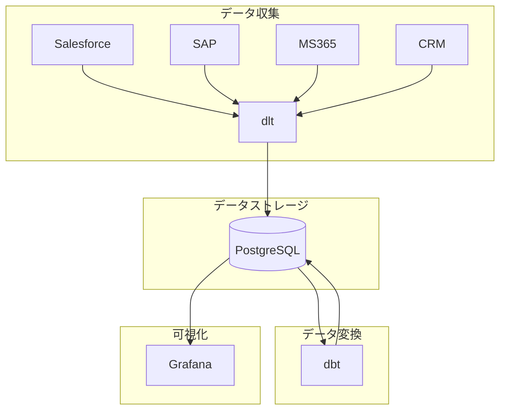
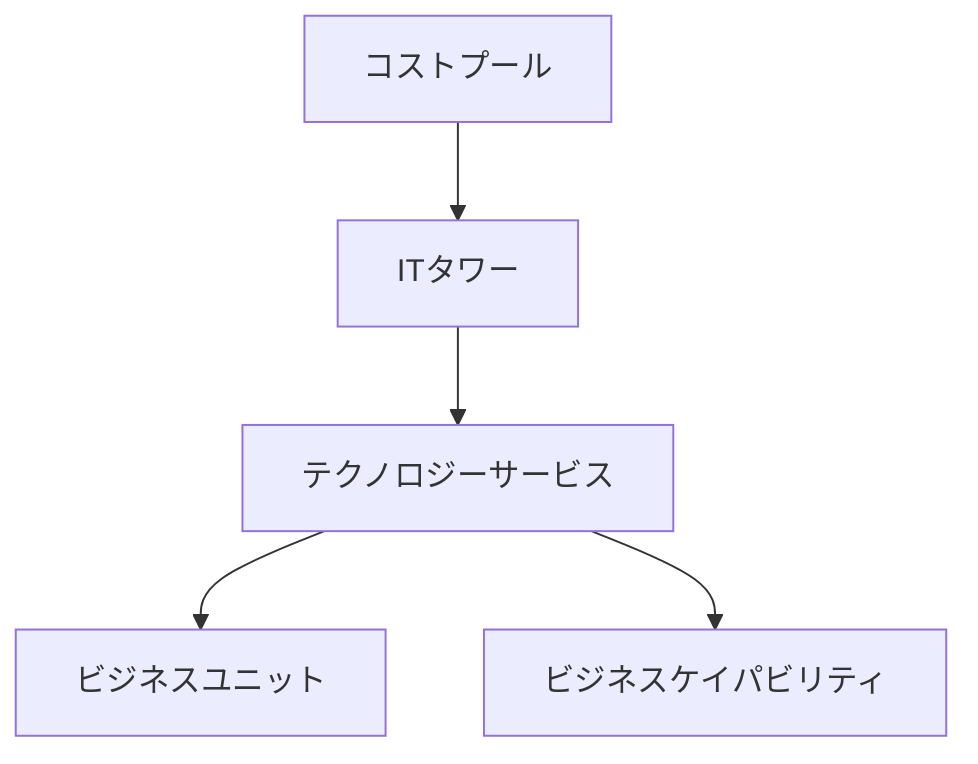
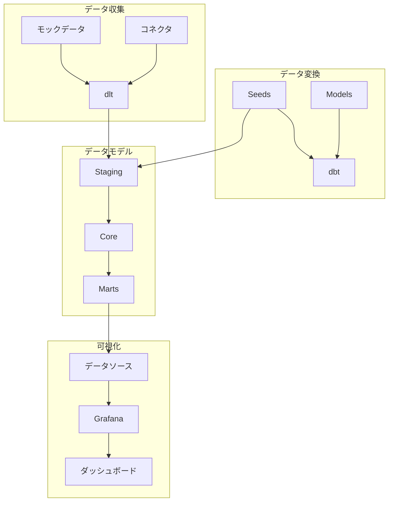

# TBM Template システムパターン

## システムアーキテクチャ

TBM Templateは、以下の4つの主要コンポーネントで構成されています：

1. **データ収集 (dlt)**: 外部サービス（Salesforce、SAP、MS365、独自開発CRM）からデータを収集します。
2. **データストレージ (PostgreSQL)**: 収集したデータと変換後のデータを保存します。
3. **データ変換 (dbt)**: TBMタクソノミーに基づいてデータを変換し、配賦計算を行います。
4. **可視化 (Grafana)**: 変換・配賦されたデータを様々な視点で可視化します。

これらのコンポーネントはすべてDocker Composeで管理され、簡単に環境を構築できるようになっています。

## 主要な技術的決定

1. **Docker Composeの採用**: 環境構築の簡素化と再現性の確保のため、Docker Composeを採用しました。これにより、OSやインストール環境に依存せず、一貫した環境を提供できます。

2. **dbtの採用**: データ変換と配賦計算のために、SQLベースのデータ変換ツールであるdbtを採用しました。dbtは、モジュール性、テスト容易性、バージョン管理との統合などの利点があります。

3. **dltの採用**: データ収集のために、Pythonベースのデータローディングツールであるdltを採用しました。dltは、様々なデータソースからのデータ収集を簡素化し、スキーマ管理やデータ型変換などの機能を提供します。

4. **Grafanaの採用**: データ可視化のために、オープンソースの可視化ツールであるGrafanaを採用しました。Grafanaは、様々なデータソースに対応し、カスタマイズ可能なダッシュボードを提供します。

5. **PostgreSQLの採用**: データストレージのために、オープンソースのリレーショナルデータベースであるPostgreSQLを採用しました。PostgreSQLは、信頼性、機能性、パフォーマンスのバランスが良く、dbtやGrafanaとの相性も良いです。

## 設計パターン

### 1. レイヤードアーキテクチャ

データモデルは、TBMタクソノミーに基づいて、以下のレイヤーで構成されています：

各レイヤー間のデータ変換と配賦は、dbtモデルで実装されています。

### 2. ETLパイプライン

データ処理は、ETL（Extract, Transform, Load）パターンに従っています：

- **Extract**: dltを使って外部サービスからデータを抽出
- **Transform**: dbtを使ってデータを変換・配賦
- **Load**: 変換・配賦されたデータをPostgreSQLに格納

### 3. マルチレイヤーデータモデリング

dbtモデルは、以下の3つのレイヤーで構成されています：

1. **Staging**: 生データを整形し、一貫した形式に変換
2. **Core**: ビジネスロジック（配賦計算など）を適用
3. **Marts**: 特定のユースケース（財務分析、IT分析、ビジネス分析など）向けにデータを集約

### 4. ダッシュボードビュー

Grafanaダッシュボードは、以下の3つの視点で構成されています：

1. **財務視点**: コストプール別の支出状況
2. **IT視点**: ITタワー、サービス別のコスト状況
3. **ビジネス視点**: 部門別、ケイパビリティ別のIT支出状況

## コンポーネント関係

このアーキテクチャにより、データの流れが明確になり、各コンポーネントの責任範囲が明確に分離されています。また、各コンポーネントは独立して開発・テスト・デプロイできるようになっています。
