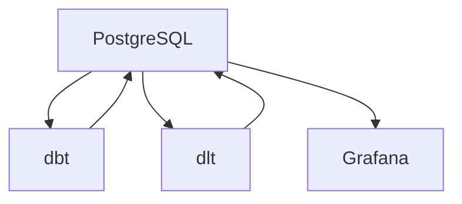

# TBM Template 技術コンテキスト

## 使用技術

TBM Templateプロジェクトでは、以下の技術を使用しています：

### 1. コンテナ化と環境管理

- **Docker**: アプリケーションをコンテナ化するためのプラットフォーム
- **Docker Compose**: 複数のコンテナを定義・実行するためのツール

### 2. データベース

- **PostgreSQL**: オープンソースのリレーショナルデータベース
  - バージョン: 15
  - 役割: データの永続化、dbtとGrafanaのバックエンド

### 3. データパイプライン

- **dbt (data build tool)**: データ変換のためのツール
  - バージョン: 1.5.0
  - 役割: データモデリング、変換、配賦計算
  - 主要コンポーネント:
    - Seeds: CSVファイルからのデータロード
    - Models: SQLベースのデータ変換
    - Macros: 再利用可能なSQLスニペット

### 4. データ収集

- **dlt (data load tool)**: データ収集のためのPythonライブラリ
  - バージョン: 0.3.0
  - 役割: 外部サービスからのデータ収集
  - 対応サービス:
    - Salesforce
    - SAP
    - Microsoft 365
    - 独自開発CRM

### 5. 可視化

- **Grafana**: データ可視化のためのオープンソースプラットフォーム
  - バージョン: 最新
  - 役割: ダッシュボード作成、データ可視化
  - 主要機能:
    - ダッシュボード
    - パネル
    - データソース設定

### 6. プログラミング言語

- **Python**: データ収集、スクリプト作成
  - バージョン: 3.10
  - 主要ライブラリ:
    - pandas: データ操作
    - numpy: 数値計算
    - requests: HTTP通信

- **SQL**: データ変換、クエリ
  - 方言: PostgreSQL

### 7. その他のツール

- **Git**: バージョン管理
- **Markdown**: ドキュメント作成

## 開発環境

### ローカル開発環境

1. **前提条件**:
   - Docker と Docker Compose がインストールされていること
   - Git がインストールされていること

2. **セットアップ手順**:
   ```bash
   # リポジトリのクローン
   git clone https://github.com/your-username/tbm-template.git
   cd tbm-template

   # 環境の起動
   docker-compose up -d
   ```

3. **開発ワークフロー**:
   - dbtモデルの開発:
     ```bash
     docker exec -it tbm-dbt bash
     cd /app/dbt/src
     dbt run
     ```
   - dltコネクタの開発:
     ```bash
     docker exec -it tbm-dlt bash
     cd /app/dlt
     python main.py
     ```
   - Grafanaダッシュボードの開発:
     - ブラウザで http://localhost:3000 にアクセス

## 技術的制約

1. **データ量**: 
   - 現在のアーキテクチャは、中小規模のデータ量を想定しています。
   - 大規模データの場合は、スケーラブルなデータベースやデータウェアハウスへの移行が必要になる可能性があります。

2. **リアルタイム性**:
   - 現在のアーキテクチャは、バッチ処理を前提としています。
   - リアルタイムデータ処理が必要な場合は、ストリーミング技術の導入が必要になります。

3. **セキュリティ**:
   - 開発環境では、簡易的な認証情報を使用しています。
   - 本番環境では、適切なセキュリティ対策（認証情報の管理、ネットワークセキュリティなど）が必要です。

4. **カスタマイズ性**:
   - テンプレートとして提供されているため、実際の環境に合わせたカスタマイズが必要です。
   - 特に、外部サービスとの連携部分は、実際のAPIに合わせた調整が必要です。

## 依存関係

### 主要な依存関係

```
# データパイプライン
dbt-core==1.5.0
dbt-postgres==1.5.0

# データ収集
dlt==0.3.0
pandas==2.0.0
numpy==1.24.3
requests==2.31.0

# ユーティリティ
python-dotenv==1.0.0
pyyaml==6.0
```

### コンテナ間の依存関係



- **PostgreSQL**: 他のすべてのサービスの基盤となるデータベース
- **dbt**: PostgreSQLに依存し、データ変換を行う
- **dlt**: PostgreSQLに依存し、データを収集・ロードする
- **Grafana**: PostgreSQLに依存し、データを可視化する

### 外部サービスとの依存関係

現在は、モックデータを使用していますが、実際の環境では以下の外部サービスとの連携が必要です：

- **Salesforce API**: Salesforceのデータ収集
- **SAP API**: SAPのデータ収集
- **Microsoft Graph API**: Microsoft 365のデータ収集
- **独自開発CRM API**: 独自開発CRMのデータ収集

これらの外部サービスとの連携は、dltコネクタを通じて行われます。
